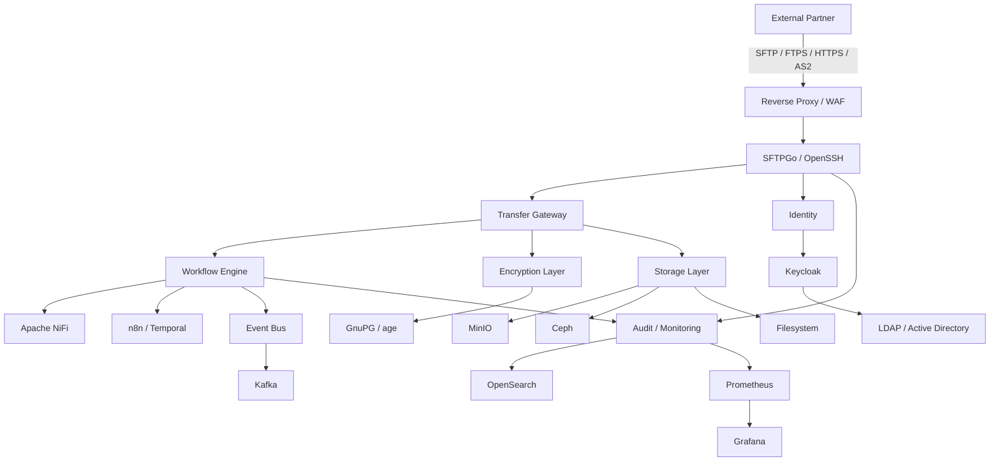
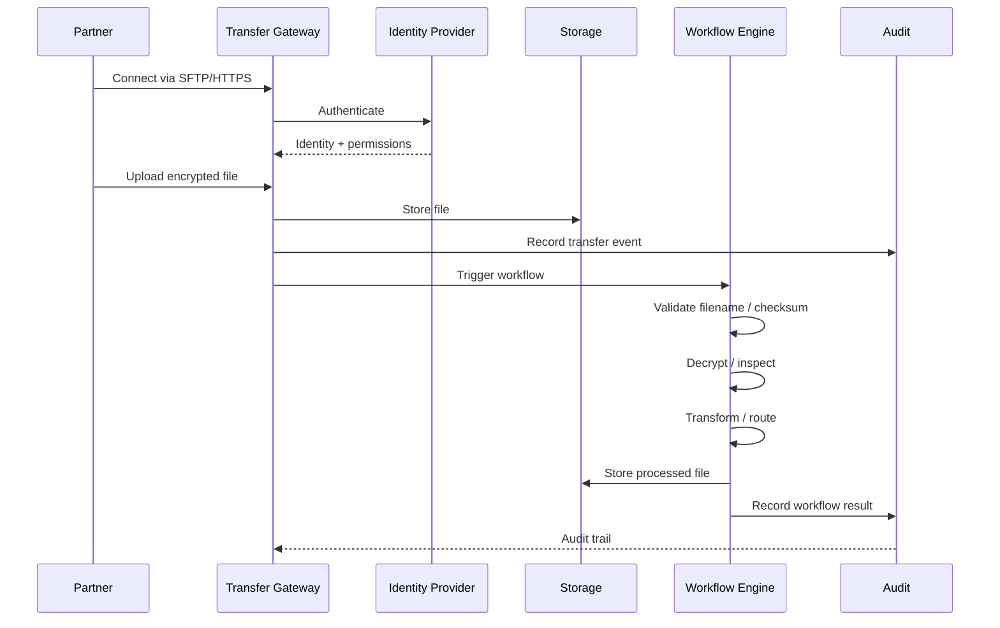
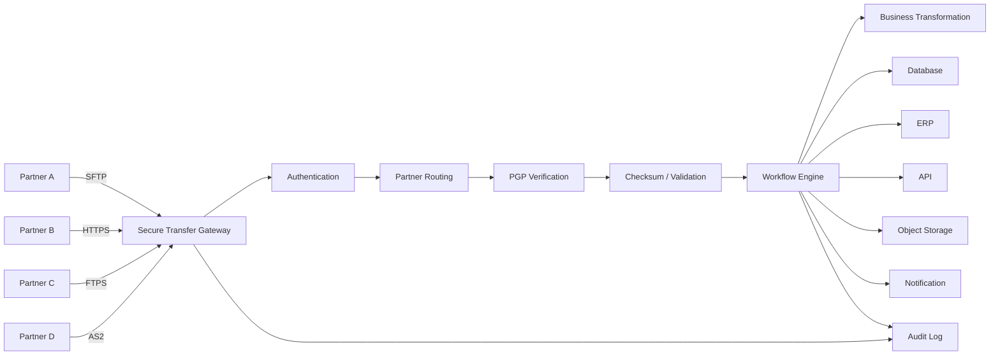
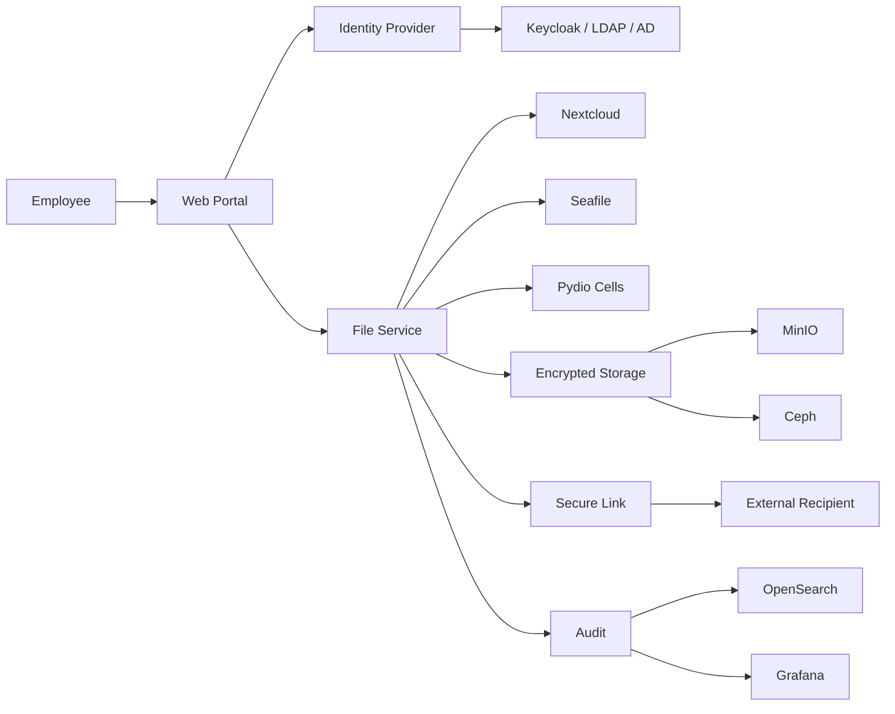
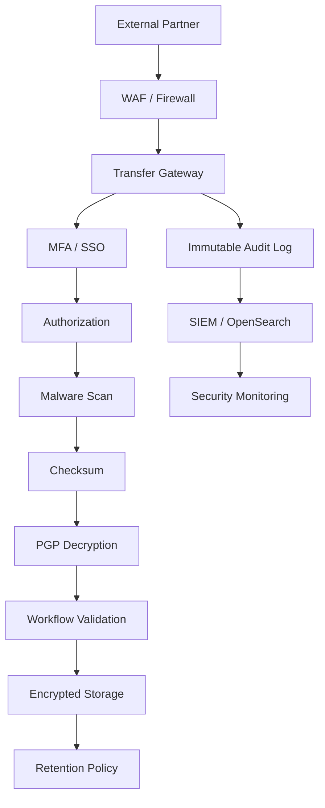

<p align="center">
  <a href="https://github.com/ishandutta2007/Awesome-Secure-File-Transfer">
    
  </a>
</p>

<h1 align="center">🔐 Awesome Secure File Transfer (MFT & SFTP) 🚀</h1>

<p align="center">
  <a href="https://github.com/ishandutta2007/Awesome-Awesome-Awesome"></a>
  <a href="https://discord.gg/SZqdTaNu9b"></a>
  <a href="https://github.com/ishandutta2007/Awesome-Secure-File-Transfer/stargazers"></a>
  <a href="https://github.com/ishandutta2007/Awesome-Secure-File-Transfer/network/members"></a>
  <a href="https://github.com/ishandutta2007/Awesome-Secure-File-Transfer/issues"></a>
  <a href="https://github.com/ishandutta2007/Awesome-Secure-File-Transfer/pulls"></a>
  <a href="LICENSE"></a>
  <a href="https://github.com/ishandutta2007"></a>
</p>

> **Curated production-grade guide and directory for Managed File Transfer (MFT), Secure SFTP / FTPS / AS2 servers, encrypted P2P data exchange, cloud object storage pipelines, enterprise B2B workflow orchestration, and compliance architectures (HIPAA, PCI-DSS, SOC 2, GDPR).**

## 📑 Table of Contents

- [🌐 Commercial & SaaS Solutions](#-commercial--saas-solutions)
  - [📊 Market Overview & Industry Dynamics](#-market-overview--industry-dynamics)
  - [💼 SaaS & Enterprise MFT Matrix](#-saas--enterprise-mft-matrix-sorted-by-market-scale--valuation)
- [⭐ Open-Source Star Leaderboard](#-open-source-star-leaderboard)
- [🛠️ Open-Source Ecosystem by Category](#️-open-source-ecosystem-by-category)
  - [1. 🔒 Core SFTP, FTPS & File Transfer Servers](#1--core-sftp-ftps--file-transfer-servers)
  - [2. 🏢 Enterprise MFT & B2B Integration Gateways](#2--enterprise-mft--b2b-integration-gateways)
  - [3. 🛡️ End-to-End Encrypted (E2EE) & Peer-to-Peer (P2P) File Sharing](#3-️-end-to-end-encrypted-e2ee--peer-to-peer-p2p-file-sharing)
  - [4. ☁️ Cloud Storage, Distributed Filesystems & Sync Engines](#4-️-cloud-storage-distributed-filesystems--sync-engines)
  - [5. 🔐 Cryptography, Identity & Zero-Trust Security Foundations](#5--cryptography-identity--zero-trust-security-foundations)
  - [6. 📡 Observability, Auditing & SIEM Telemetry Pipelines](#6--observability-auditing--siem-telemetry-pipelines)
- [🔄 Commercial → Open-Source Mapping](#-commercial--open-source-mapping)
- [🏗️ Architecture Patterns](#️-architecture-patterns)
- [📋 Operational Capability Checklist](#-operational-capability-checklist)
- [🎯 Recommended Path](#-recommended-path-starting-today)
- [📈 Star History](#-star-history)
- [🤝 Contributing](#-contributing)

---

## 🌐 Commercial & SaaS Solutions

### 📊 Market Overview & Industry Dynamics

> 💡 **Market Size & Industry Structure:** The global Managed File Transfer (MFT) and secure file exchange market is currently valued at **$2.3 Billion** and is projected to expand to **$4.9 Billion by 2030** (CAGR of **~11.4%**). The sector exhibits **moderate fragmentation with high bifurcated concentration**: public hyperscale cloud providers (**Microsoft Azure**, **Google Cloud**, **AWS**) dominate commodity cloud-storage SFTP endpoints and ingress pipes, while specialized private-equity backed cybersecurity conglomerates (**Fortra**, **Progress Software**, **Cloud Software Group**, **Axway**, and **Insight Partners / Kiteworks**) hold deep enterprise-wide B2B and regulatory compliance lock-in across banking, healthcare, aerospace, and government.

### 💼 SaaS & Enterprise MFT Matrix (Sorted by Market Scale / Valuation)

| Product | Focus | Core Strengths | Starting Tier Pricing | Free Tier / Trial Limits | Company Scale (Valuation / Revenue) |
|:---|:---|:---|:---|:---|:---|
| [Azure Blob SFTP](https://learn.microsoft.com/en-us/azure/storage/blobs/secure-file-transfer-protocol-support) | Cloud SFTP | SFTP directly against Azure Blob Storage | Starts at **$0.30/hour** (~$216/month per enabled storage account) + standard Blob storage/transaction rates ($0.018/GB Hot tier) | **$200 credit for 30 days** via Azure Free Account (applies to SFTP hourly fee and storage) | **~$3.1T+** Market Cap (Microsoft) / **~$250B+** Revenue |
| [Google Cloud Storage SFTP solutions](https://cloud.google.com/storage) | Cloud storage transfer | Cloud-native secure transfer architectures | Starts at **~$0.06–$0.14/hour** (~$43–$100/month via GCP Marketplace SFTP Gateway / Compute Engine VM e.g. Thorn Technologies SFTP Gateway at $0.06/hr + GCS storage at $0.020/GB) | **$300 credit for 90 days** via Google Cloud Free Program; GCS Always-Free tier includes **5 GB-months** storage, 5,000 Class A ops, and 100 GB egress/month | **~$2.1T+** Market Cap (Alphabet / Google) / **~$350B+** Revenue |
| [AWS Transfer Family](https://aws.amazon.com/aws-transfer-family/) | Cloud SFTP/FTPS/FTP | Managed endpoints connected to S3/EFS | Starts at **$0.30/endpoint hour** (~$216/month baseline for 1 SFTP protocol endpoint) + **$0.04/GB** data processed | **$300 credit for 30 days** via AWS Free Tier for new accounts (applies to Transfer Family endpoint hours and data transfer) | **~$2.0T+** Market Cap (Amazon) / **~$620B+** Revenue |
| [Oracle Managed File Transfer](https://www.oracle.com/integration/managed-file-transfer/) | Enterprise MFT | Workflow, transfer and integration | Starts at **$30,000/processor** (perpetual license + $6,600/year software update support; or OCI BYOL/Compute starting at ~$2.50/OCPU-hour) | **30-day trial with $300 free cloud credits** on Oracle Cloud Infrastructure (OCI); free OTN developer evaluation license | **~$380B+** Market Cap (Oracle) / **~$53B+** Revenue |
| [MuleSoft Anypoint Platform](https://www.mulesoft.com/platform/anypoint-platform) | Integration | APIs, B2B and application integration | Starts at **~$27,000/year** (Integration Starter tier, or ~$2,250/month; full Anypoint Enterprise deployments start at ~$150,000/year) | **30-day free trial** with full access to Anypoint Design Center, API Manager, and Runtime Manager (no credit card required) | **~$280B+** Market Cap (Salesforce) / **~$38B+** Revenue |
| [SAP Integration Suite](https://www.sap.com/products/technology-platform/integration-suite.html) | Integration / MFT | Enterprise integration and B2B connectivity | Starts at **€4,635/month** (~$5,050/month for Standard Edition tenant; Pay-As-You-Go / CPEA models available) | **90-day Free Tier** on SAP BTP (includes 10,000 messages/month and free SAP-to-SAP messages before decommissioning) | **~$260B+** Market Cap (SAP SE) / **~$35B+** Revenue |
| [IBM Sterling File Transfer](https://www.ibm.com/products/sterling-file-transfer) | Enterprise MFT | Large-scale B2B transfers, partner management, automation | Starts at **$2,800/year** (~$233.33/month for B2B Integration SaaS Essentials; enterprise Sterling File Gateway deployments start at **~$20,000–$30,000/year**) | **30-day guided enterprise sandbox / proof of concept** on IBM Cloud with interactive file transfer workflow tours | **~$210B+** Market Cap (IBM) / **~$63B+** Revenue |
| [IBM Sterling File Gateway](https://www.ibm.com/products/sterling-file-gateway) | B2B gateway | Partner onboarding and high-volume transfer | Starts at **~$20,000–$30,000/year** (entry enterprise subscription for partner onboarding and multi-protocol gateway routing) | **30-day guided enterprise sandbox / proof of concept** on IBM Cloud with interactive file transfer workflow tours | **~$210B+** Market Cap (IBM) / **~$63B+** Revenue |
| [Red Hat Integration](https://www.redhat.com/en/technologies/cloud-computing/integration) | Integration | API, messaging and integration workflows | Starts at **~$7,500/year** (Standard 2-core / 4-vCPU unit subscription; Premium tier ~$11,250/year per 2 cores) | **60-day free product trial** through Red Hat Customer Portal; permanent free **Red Hat Developer Subscription for Individuals** (up to 16 nodes for development/testing) | **~$210B+** Parent Cap (IBM) / **~$6.5B+** Red Hat Revenue |
| [Citrix ShareFile](https://www.sharefile.com/) | Secure file sharing | Business collaboration, secure links, client portals | Starts at **$16.50/user/month** (billed annually, min 3 users = **$49.50/month**; Premium tier at $26.00/user/month; VDR at $69.30/user/month) | **14-day free trial** (up to 25 users, full sharing features, client portals, and e-signatures; no credit card required) | **~$16.5B** Valuation (Cloud Software Group) / **~$3.2B+** Revenue |
| [Workato](https://www.workato.com/) | Automation / integration | Workflow automation and enterprise integrations | Starts at **~$10,000–$15,000/year** (Base Workspace tier for up to 500,000 tasks/year; scaling with recipe and task packs) | **30-day interactive trial sandbox** upon sales request / guided PoC with pre-built connectors and test recipe executions | **$5.7B** Valuation ($200M Series E) / **~$250M+** ARR |
| [Boomi](https://boomi.com/) | Integration | B2B, API and data integration | Starts at **$99/month** base fee (+ $0.05/message processed on Pay-As-You-Go; Enterprise subscriptions start at ~$20,000/year) | **30-day free trial** with access to full platform features, up to 3 standard connectors, and 3 test connectors | **~$4.0B** Valuation (Francisco Partners / TPG) / **~$500M+** Revenue |
| [Thru](https://www.thruinc.com/) | Cloud MFT | Secure file exchange, automation, APIs | Starts at **~$6,000–$12,000/year** (tiered capacity starting at ~£500–£1,000/month based on data volume; G-Cloud listing £3,151/month for full multi-tenant enterprise) | **30-day free trial** / pilot environment with up to 50 GB transfer quota and standard connector setup | **~$4.0B** Parent Valuation (Boomi) / **~$500M+** Revenue |
| [Fortra GoAnywhere MFT](https://www.goanywhere.com/) | Enterprise MFT | Multi-protocol transfer, automation, workflows, B2B | Starts at **~$3,995–$4,000/year** (baseline tier for single server and core protocols/automation; enterprise clusters $10,000+/year) | **30-day free trial** (fully functional evaluation covering multi-protocol transfers, workflows, and cloud connectors) | **~$3.0B+** Valuation (HGGC / TA Associates) / **~$800M+** Revenue |
| [GlobalSCAPE EFT](https://www.globalscape.com/eft) | Enterprise MFT | Secure transfer, automation, workflow and compliance | Starts at **~$7,800/year** (~£6,000/year G-Cloud listing, ~$495/month for EFT Arcus cloud tier; perpetual server licenses from $875) | **30-day free trial** for EFT Server (15-day free trial for EFT Arcus SaaS) with full enterprise MFT modules and event rules | **~$3.0B+** Valuation (Fortra) / **~$800M+** Revenue |
| [Progress MOVEit](https://www.progress.com/moveit) | Enterprise MFT | Secure transfers, automation, compliance, auditing | Starts at **~$2,500–$4,900/year** (~£125.86–£158/user/year on G-Cloud / reseller listings; ~$140/user/year base pack) | **30-day free trial** for MOVEit Cloud & Transfer (up to 25 users with full MFT automation and auditing); free MOVEit Client for recipients | **~$2.6B** Market Cap (Progress Software) / **~$750M+** Revenue |
| [Redwood MFT](https://www.redwood.com/) | MFT / automation | Managed transfer and workload automation | Starts at **~$12,000–$18,000/year** (enterprise MFT / workload automation starting bundle; scaling with server endpoints) | **7-day free trial** / guided enterprise sandbox with full workflow orchestration and multi-protocol file routing | **~$2.5B** Valuation (Turn/River Capital) / **~$200M+** ARR |
| [JSCAPE MFT Server](https://www.jscape.com/) | MFT | Multi-protocol transfer, automation, hybrid deployment | Starts at **~$4,500–$6,000/year** (baseline tier for single server domain/instance; enterprise tier scales with domains and clustering) | **7-day free trial** (fully functional evaluation limited to 3 users and 1 domain) | **~$2.5B** Parent Valuation (Redwood Software) / **~$200M+** ARR |
| [SolarWinds Serv-U](https://www.solarwinds.com/serv-u) | MFT / file transfer | SFTP, FTPS, HTTPS, automation | Starts at **$634** (Serv-U FTP Server perpetual license; Serv-U MFT Server starts at **$3,827** perpetual license with 1 year maintenance included) | **14-day free trial** with fully functional MFT features, multi-protocol endpoints, and web client | **~$2.2B** Market Cap (SolarWinds) / **~$780M+** Revenue |
| [Kiteworks](https://www.kiteworks.com/) | Secure content communications | Secure file sharing, governance, compliance, email/file transfer | Starts at **$15.00–$25.50/user/month** (annual contract, typically min 10 users = **~$1,800–$3,060/year**; G-Cloud tiers £34–£202/user/year) | **14-day guided Proof of Concept (PoC)** / trial on request (up to 10 users with full governance and audit trails) | **~$1.0B+** Valuation (Insight Partners / Unicorn) / **~$150M+** ARR |
| [Axway Managed File Transfer](https://www.axway.com/en/products/managed-file-transfer) | Enterprise MFT | B2B exchange, governance, API/integration ecosystem | Starts at **~$18,000/year** (~$1,500/month baseline subscription for Transfer CFT and core MFT gateway; scaling with transfer volume) | **30-day guided Proof of Concept (PoC)** / interactive sandbox evaluation available on request with pre-configured Transfer CFT instances | **~$750M+** Market Cap (Axway Software) / **~$350M+** Revenue |
| [Axway SecureTransport](https://www.axway.com/en/products/securetransport) | Enterprise MFT | Secure partner file exchange | Starts at **~$18,000/year** (~$1,500/month baseline subscription for gateway instance and standard partner routing) | **30-day guided Proof of Concept (PoC)** / interactive sandbox evaluation available on request | **~$750M+** Market Cap (Axway Software) / **~$350M+** Revenue |
| [Files.com](https://www.files.com/) | Cloud file operations | Secure file sharing, SFTP, automation, APIs | Starts at **$199/month** ($2,148/year billed annually for Starter tier: 10 Full Users, 50 System Users, 2 outbound connections; extra users $12/user/mo) | **7-day free trial** with full access to SFTP/FTPS/AS2 protocols, integrations, and automation workflows (no credit card required) | **~$400M+** Valuation (Action Capital / Riverside) / **~$60M+** ARR |
| [ExaVault](https://www.exavault.com/) | Cloud file transfer | Secure file sharing and SFTP | Starts at **$99/month** (per 50-user pack for on-prem appliance; cloud SaaS starting at $199/month via Files.com) | **Free Forever plan** for on-premise appliance (up to 50 users indefinitely with full SFTP/web sharing); **7-day free trial** for cloud platform | **~$400M+** Parent Valuation (Files.com) / **~$60M+** ARR |
| [Cleo Integration Cloud](https://www.cleo.com/) | Integration + MFT | B2B integration, APIs, EDI, workflows | Starts at **~$12,000–$25,000/year** (~$1,000–$2,000/month baseline subscription for core B2B MFT endpoints; mid-market bundles scale higher) | **30-day guided Proof of Concept (PoC)** / sandbox evaluation available on request with technical scoping | **~$350M+** Valuation (H.I.G. Capital) / **~$100M+** ARR |
| [Cleo Harmony](https://www.cleo.com/products/harmony) | B2B integration | EDI, APIs, MFT and partner workflows | Starts at **~$3,500–$5,000/year** (base license per server endpoint for enterprise on-premise/hybrid multi-protocol MFT) | **30-day evaluation license** provided by Cleo engineering with up to 5 trading partner connections | **~$350M+** Valuation (H.I.G. Capital) / **~$100M+** ARR |
| [Couchdrop](https://www.couchdrop.io/) | Cloud SFTP | SFTP gateway to cloud storage | Starts at **$50/month** (Couchdrop Link tier; Essentials starts at ~$99/month for cloud storage endpoints) | **14-day free trial** with instant access to cloud storage connectors and SFTP endpoints (no credit card required) | **~$25M–$50M** Valuation (Venture-backed) / **~$10M+** ARR |
| [Titan MFT](https://titanftp.com/) | Secure file transfer | SFTP/FTP/FTPS and enterprise transfer | Starts at **$599.95** (one-time perpetual server license for Standard; or ~$750–$1,250/year cloud subscription/support; Enterprise tier ~$1,949.95) | **20-day free trial** with full multi-protocol server functionality and administrative controls | **~$15M–$30M** Valuation (South River Tech) / **~$5M+** Revenue |
| [SmartFile](https://www.smartfile.com/) | Secure file transfer | SFTP, file sharing, automation | Starts at **$10/user/month** (Business tier, or ~$100/month minimum base plan with storage and multi-user support) | **14-day free trial** with full access to SFTP/FTP features, custom branding, and granular permissions (no credit card required) | **~$15M–$25M** Valuation / **~$5M+** Revenue |
| [SFTP To Go](https://sftptogo.com/) | Cloud MFT | Managed SFTP/FTPS/HTTPS, object storage integration | Starts at **$150/month** (Launch tier, includes 10 credentials, 100 GB storage, 250 GB monthly bandwidth; discounted on annual billing) | **7-day free trial** with full platform features, web portal, API access, and automations (no credit card required) | **~$10M–$20M** Valuation (Crazy Ant Labs) / **~$3M+** ARR |
| [FilesAnywhere](https://www.filesanywhere.com/) | Secure file sharing | Business file storage and sharing | Starts at **$8.99/user/month** (Business Starter plan, min 2 users = $17.98/month; Professional at $13.99/user/month) | **Free Forever plan** (1 GB storage, 1 user; requires login once every 60 days); **14-day free trial** for Business/Professional plans (no credit card required) | **~$10M–$20M** Valuation (Finlink Inc.) / **~$4M+** Revenue |
| [Cerberus FTP Server](https://www.cerberusftp.com/) | Secure file server | SFTP, FTPS, HTTPS and managed transfer | Starts at **$1,599/year** (Professional Edition annual subscription; Enterprise at $3,499/year) | **25-day free trial** with full Professional & Enterprise features unlocked | **~$10M–$20M** Valuation (Cerberus LLC) / **~$3M+** Revenue |

---

## ⭐ Open-Source Star Leaderboard

Ranked live by GitHub stargazers count (descending) across all featured open-source file transfer, MFT, synchronization, encryption, and telemetry platforms.

| Rank | Repository | Stars | Primary Domain / Focus | Key Tech Stack |
|:---:|:---|:---:|:---|:---|
| 1 | [n8n-io/n8n](https://github.com/n8n-io/n8n) [](https://github.com/n8n-io/n8n/stargazers) | **203,876** | Workflow Automation & MFT Pipelines | `TypeScript / Node.js` |
| 2 | [localsend/localsend](https://github.com/localsend/localsend) [](https://github.com/localsend/localsend/stargazers) | **90,454** | Cross-Platform Local P2P Transfer | `Flutter / Dart` |
| 3 | [syncthing/syncthing](https://github.com/syncthing/syncthing) [](https://github.com/syncthing/syncthing/stargazers) | **88,434** | Continuous P2P File Synchronization | `Go` |
| 4 | [grafana/grafana](https://github.com/grafana/grafana) [](https://github.com/grafana/grafana/stargazers) | **76,655** | Operational Dashboards & Audit Telemetry | `TypeScript / Go` |
| 5 | [prometheus/prometheus](https://github.com/prometheus/prometheus) [](https://github.com/prometheus/prometheus/stargazers) | **66,013** | Metrics Collection & Transfer Alerting | `Go` |
| 6 | [minio/minio](https://github.com/minio/minio) [](https://github.com/minio/minio/stargazers) | **61,366** | High-Performance S3 Compatible Object Store | `Go` |
| 7 | [rclone/rclone](https://github.com/rclone/rclone) [](https://github.com/rclone/rclone/stargazers) | **59,664** | Multi-Cloud Storage Sync & Transfer CLI | `Go` |
| 8 | [apache/airflow](https://github.com/apache/airflow) [](https://github.com/apache/airflow/stargazers) | **46,793** | Programmatic Batch Transfer Orchestration | `Python` |
| 9 | [curl/curl](https://github.com/curl/curl) [](https://github.com/curl/curl/stargazers) | **42,820** | Command-Line Data Transfer Tool & Library | `C` |
| 10 | [schollz/croc](https://github.com/schollz/croc) [](https://github.com/schollz/croc/stargazers) | **40,286** | Encrypted CLI P2P File Transfer (PAKE) | `Go` |
| 11 | [nextcloud/server](https://github.com/nextcloud/server) [](https://github.com/nextcloud/server/stargazers) | **36,761** | Self-Hosted Collaboration & Enterprise File Sync | `PHP / JS` |
| 12 | [keycloak/keycloak](https://github.com/keycloak/keycloak) [](https://github.com/keycloak/keycloak/stargazers) | **36,688** | Identity & Access Management (OIDC / OAuth2) | `Java` |
| 13 | [filebrowser/filebrowser](https://github.com/filebrowser/filebrowser) [](https://github.com/filebrowser/filebrowser/stargazers) | **35,959** | Lightweight Web File Manager & Transfer Portal | `Go / Vue` |
| 14 | [restic/restic](https://github.com/restic/restic) [](https://github.com/restic/restic/stargazers) | **35,953** | Secure Deduplicating Encrypted Backup & Sync | `Go` |
| 15 | [seaweedfs/seaweedfs](https://github.com/seaweedfs/seaweedfs) [](https://github.com/seaweedfs/seaweedfs/stargazers) | **34,555** | Distributed Object Store & Volume Server | `Go` |
| 16 | [apache/kafka](https://github.com/apache/kafka) [](https://github.com/apache/kafka/stargazers) | **33,695** | High-Throughput Streaming & Event Log Engine | `Java / Scala` |
| 17 | [openssl/openssl](https://github.com/openssl/openssl) [](https://github.com/openssl/openssl/stargazers) | **30,770** | TLS / Cryptographic Primitive Toolkit | `C` |
| 18 | [authelia/authelia](https://github.com/authelia/authelia) [](https://github.com/authelia/authelia/stargazers) | **28,864** | Zero-Trust Web Portal Forward Authentication & 2FA | `Go` |
| 19 | [kestra-io/kestra](https://github.com/kestra-io/kestra) [](https://github.com/kestra-io/kestra/stargazers) | **28,061** | Event-Driven Declarative MFT Orchestration | `Java` |
| 20 | [goauthentik/authentik](https://github.com/goauthentik/authentik) [](https://github.com/goauthentik/authentik/stargazers) | **25,416** | Modern Open-Source IDP & SSO Gateway | `Python / Go` |
| 21 | [node-red/node-red](https://github.com/node-red/node-red) [](https://github.com/node-red/node-red/stargazers) | **23,638** | Low-Code Event-Driven Pipeline Integration | `JavaScript / Node.js` |
| 22 | [FiloSottile/age](https://github.com/FiloSottile/age) [](https://github.com/FiloSottile/age/stargazers) | **23,504** | Modern Cryptographic File Encryption Tool | `Go` |
| 23 | [temporalio/temporal](https://github.com/temporalio/temporal) [](https://github.com/temporalio/temporal/stargazers) | **22,935** | Durable Transfer Workflow Execution Engine | `Go` |
| 24 | [magic-wormhole/magic-wormhole](https://github.com/magic-wormhole/magic-wormhole) [](https://github.com/magic-wormhole/magic-wormhole/stargazers) | **22,918** | Secure CLI One-Time Code File Transfer (SPAKE2) | `Python` |
| 25 | [SnapDrop/snapdrop](https://github.com/SnapDrop/snapdrop) [](https://github.com/SnapDrop/snapdrop/stargazers) | **19,718** | Browser-Based WebRTC Local P2P Transfer | `JavaScript / WebRTC` |
| 26 | [windmill-labs/windmill](https://github.com/windmill-labs/windmill) [](https://github.com/windmill-labs/windmill/stargazers) | **17,832** | Developer-Centric Fast Workflow Engine | `Rust / Svelte` |
| 27 | [ceph/ceph](https://github.com/ceph/ceph) [](https://github.com/ceph/ceph/stargazers) | **17,021** | Distributed Unified Object, Block & File System | `C++` |
| 28 | [haiwen/seafile](https://github.com/haiwen/seafile) [](https://github.com/haiwen/seafile/stargazers) | **15,228** | High-Performance Cloud Storage & File Sync | `C / Python` |
| 29 | [mickael-kerjean/filestash](https://github.com/mickael-kerjean/filestash) [](https://github.com/mickael-kerjean/filestash/stargazers) | **14,649** | Web UI Client for SFTP, S3 & Cloud Storage | `Go / Vue` |
| 30 | [jedisct1/libsodium](https://github.com/jedisct1/libsodium) [](https://github.com/jedisct1/libsodium/stargazers) | **13,946** | Modern, Portable Cryptography Library | `C` |
| 31 | [borgbackup/borg](https://github.com/borgbackup/borg) [](https://github.com/borgbackup/borg/stargazers) | **13,701** | Deduplicating Authenticated & Encrypted Archive | `Python / C` |
| 32 | [opensearch-project/OpenSearch](https://github.com/opensearch-project/OpenSearch) [](https://github.com/opensearch-project/OpenSearch/stargazers) | **13,693** | Distributed Audit Log Analytics & Search Engine | `Java` |
| 33 | [drakkan/sftpgo](https://github.com/drakkan/sftpgo) [](https://github.com/drakkan/sftpgo/stargazers) | **12,498** | Full-Featured SFTP/SCP/FTPS/WebDAV Server | `Go` |
| 34 | [schlagmichdoch/PairDrop](https://github.com/schlagmichdoch/PairDrop) [](https://github.com/schlagmichdoch/PairDrop/stargazers) | **11,360** | Resilient WebRTC Local & Remote P2P Sharing | `JavaScript / WebRTC` |
| 35 | [owncloud/core](https://github.com/owncloud/core) [](https://github.com/owncloud/core/stargazers) | **8,831** | Enterprise Cloud Storage & File Collaboration | `PHP` |
| 36 | [PrivateBin/PrivateBin](https://github.com/PrivateBin/PrivateBin) [](https://github.com/PrivateBin/PrivateBin/stargazers) | **8,594** | Zero-Knowledge Encrypted Paste & File Sharing | `PHP / JS` |
| 37 | [open-telemetry/opentelemetry-collector](https://github.com/open-telemetry/opentelemetry-collector) [](https://github.com/open-telemetry/opentelemetry-collector/stargazers) | **7,517** | Vendor-Agnostic Telemetry & Audit Pipeline | `Go` |
| 38 | [apache/nifi](https://github.com/apache/nifi) [](https://github.com/apache/nifi/stargazers) | **6,225** | Visual Data Routing, Flow Management & SFTP ETL | `Java` |
| 39 | [timvisee/send](https://github.com/timvisee/send) [](https://github.com/timvisee/send/stargazers) | **5,897** | End-to-End Encrypted Ephemeral File Sharing | `TypeScript / Rust` |
| 40 | [RsyncProject/rsync](https://github.com/RsyncProject/rsync) [](https://github.com/RsyncProject/rsync/stargazers) | **5,200** | Delta-Transfer Remote File Synchronization Algorithm | `C` |
| 41 | [mutagen-io/mutagen](https://github.com/mutagen-io/mutagen) [](https://github.com/mutagen-io/mutagen/stargazers) | **4,414** | Real-Time Bidirectional Sync & SSH Forwarding | `Go` |
| 42 | [openssh/openssh-portable](https://github.com/openssh/openssh-portable) [](https://github.com/openssh/openssh-portable/stargazers) | **3,999** | De-facto Standard SSH / SFTP Protocol Daemon | `C` |
| 43 | [filegator/filegator](https://github.com/filegator/filegator) [](https://github.com/filegator/filegator/stargazers) | **3,066** | Multi-User Web File Manager with Granular Auth | `PHP / Vue` |
| 44 | [openstack/swift](https://github.com/openstack/swift) [](https://github.com/openstack/swift/stargazers) | **2,798** | Distributed Eventually Consistent Object Store | `Python` |
| 45 | [pydio/cells](https://github.com/pydio/cells) [](https://github.com/pydio/cells/stargazers) | **2,245** | Golang Enterprise Content Services & Secure Sharing | `Go` |
| 46 | [owncloud/ocis](https://github.com/owncloud/ocis) [](https://github.com/owncloud/ocis/stargazers) | **2,115** | Cloud-Native Next-Gen Infinite Scale Collaboration | `Go / Vue` |
| 47 | [linuxmint/warpinator](https://github.com/linuxmint/warpinator) [](https://github.com/linuxmint/warpinator/stargazers) | **1,585** | LAN File Transfer Tool for Secure Desktops | `Python` |
| 48 | [lavv17/lftp](https://github.com/lavv17/lftp) [](https://github.com/lavv17/lftp/stargazers) | **1,300** | Sophisticated Scriptable Multi-Protocol Transfer Client | `C++` |
| 49 | [psanford/wormhole-william](https://github.com/psanford/wormhole-william) [](https://github.com/psanford/wormhole-william/stargazers) | **1,253** | Go Implementation of Magic-Wormhole Protocol | `Go` |
| 50 | [apache/mina-sshd](https://github.com/apache/mina-sshd) [](https://github.com/apache/mina-sshd/stargazers) | **1,093** | Java Asynchronous SSH/SFTP Embedded Server Framework | `Java` |
| 51 | [proftpd/proftpd](https://github.com/proftpd/proftpd) [](https://github.com/proftpd/proftpd/stargazers) | **600** | Highly Configurable Modular FTP / FTPS / SFTP Server | `C` |
| 52 | [cozy/cozy](https://github.com/cozy/cozy) [](https://github.com/cozy/cozy/stargazers) | **447** | Personal Cloud & Document Synchronization Platform | `Go / Node.js` |
| 53 | [apache/commons-vfs](https://github.com/apache/commons-vfs) [](https://github.com/apache/commons-vfs/stargazers) | **251** | Unified Java Virtual File System Abstraction API | `Java` |
| 54 | [muriaga/ProjectSend](https://github.com/muriaga/ProjectSend) [](https://github.com/muriaga/ProjectSend/stargazers) | **1** | Secure Client File Sharing & Portal Repository | `PHP` |

---

## 🛠️ Open-Source Ecosystem by Category

### 1. 🔒 Core SFTP, FTPS & File Transfer Servers

Dedicated server daemons and high-throughput transfer protocol engines capable of handling SFTP subsystem calls, virtual chroots, key management, and cloud storage backends.

- **[SFTPGo](https://github.com/drakkan/sftpgo)** [](https://github.com/drakkan/sftpgo/stargazers) — Fully featured, highly scalable, and secure SFTP/SCP/FTPS/WebDAV server with native S3, Azure Blob, and Google Cloud Storage backends, event triggers, and REST API administration.
- **[rsync](https://github.com/RsyncProject/rsync)** [](https://github.com/RsyncProject/rsync/stargazers) — The ubiquitous, ultra-fast incremental file transfer utility and protocol utilizing delta-compression algorithms over encrypted SSH tunnels.
- **[OpenSSH](https://github.com/openssh/openssh-portable)** [](https://github.com/openssh/openssh-portable/stargazers) — The premier security tool for remote login and secure file transfer (SFTP/SCP) utilizing the SSH-2 protocol suite.
- **[FileGator](https://github.com/filegator/filegator)** [](https://github.com/filegator/filegator/stargazers) — Lightweight multi-user web file manager with granular permission hierarchies, SFTP storage bridge, and user management.
- **[LFTP](https://github.com/lavv17/lftp)** [](https://github.com/lavv17/lftp/stargazers) — Sophisticated command-line file transfer client supporting SFTP, FTPS, HTTP, and BitTorrent with built-in segmented acceleration and mirroring.
- **[Apache MINA SSHD](https://github.com/apache/mina-sshd)** [](https://github.com/apache/mina-sshd/stargazers) — Scalable Java library enabling asynchronous SSH and SFTP server and client architectures.
- **[ProFTPD](https://github.com/proftpd/proftpd)** [](https://github.com/proftpd/proftpd/stargazers) — Highly configurable, modular FTP/FTPS/SFTP daemon trusted for decades in production enterprise infrastructure.
- **[Apache Commons VFS](https://github.com/apache/commons-vfs)** [](https://github.com/apache/commons-vfs/stargazers) — Unified Virtual File System Java framework abstracting SFTP, FTP, HTTP, and local filesystem access.

### 2. 🏢 Enterprise MFT & B2B Integration Gateways

Workflow orchestration and B2B file routing systems that replace legacy proprietary solutions (IBM Sterling, Axway, MOVEit) with modern event-driven pipelines.

- **[n8n](https://github.com/n8n-io/n8n)** [](https://github.com/n8n-io/n8n/stargazers) — Fair-code workflow automation platform with comprehensive SFTP, S3, webhook, and enterprise integration connectors.
- **[Apache Airflow](https://github.com/apache/airflow)** [](https://github.com/apache/airflow/stargazers) — Production-proven programmatic workflow orchestrator for authoring, scheduling, and monitoring complex batch file transfer pipelines.
- **[Kestra](https://github.com/kestra-io/kestra)** [](https://github.com/kestra-io/kestra/stargazers) — Modern, infinitely scalable event-driven orchestrator built for declarative YAML-based MFT, data movements, and SFTP transfers.
- **[Node-RED](https://github.com/node-red/node-red)** [](https://github.com/node-red/node-red/stargazers) — Low-code browser-based flow editor connecting hardware devices, APIs, SFTP streams, and cloud endpoints.
- **[Temporal](https://github.com/temporalio/temporal)** [](https://github.com/temporalio/temporal/stargazers) — Durable execution system ensuring distributed file transfers never fail silently and automatically survive crashes and network partitions.
- **[Windmill](https://github.com/windmill-labs/windmill)** [](https://github.com/windmill-labs/windmill/stargazers) — High-performance developer platform for converting Python, TypeScript, and Bash file transfer scripts into scheduled, audited internal MFT workflows.
- **[Apache NiFi](https://github.com/apache/nifi)** [](https://github.com/apache/nifi/stargazers) — Enterprise data logistics engine providing visual flow management, data provenance, protocol transformation, and guaranteed SFTP delivery.

### 3. 🛡️ End-to-End Encrypted (E2EE) & Peer-to-Peer (P2P) File Sharing

Zero-knowledge, direct-device, and P2P communication utilities eliminating central server exposure for confidential files.

- **[LocalSend](https://github.com/localsend/localsend)** [](https://github.com/localsend/localsend/stargazers) — Open-source cross-platform air-dropped local file sharing using secure HTTPS REST endpoints without internet reliance.
- **[Syncthing](https://github.com/syncthing/syncthing)** [](https://github.com/syncthing/syncthing/stargazers) — Continuous, decentralized peer-to-peer file synchronization utilizing TLS 1.3 encryption, perfect forward secrecy, and zero cloud lock-in.
- **[croc](https://github.com/schollz/croc)** [](https://github.com/schollz/croc/stargazers) — CLI tool that allows any two computers to easily and securely transfer files and folders using PAKE password exchange and end-to-end encryption.
- **[Magic-Wormhole](https://github.com/magic-wormhole/magic-wormhole)** [](https://github.com/magic-wormhole/magic-wormhole/stargazers) — Securely get things from one computer to another using human-pronounceable one-time transit codes (SPAKE2).
- **[Snapdrop](https://github.com/SnapDrop/snapdrop)** [](https://github.com/SnapDrop/snapdrop/stargazers) — WebRTC-based browser-to-browser local file sharing client inspired by Apple AirDrop.
- **[PairDrop](https://github.com/schlagmichdoch/PairDrop)** [](https://github.com/schlagmichdoch/PairDrop/stargazers) — Enhanced fork of Snapdrop supporting direct device pairing via six-digit codes or QR codes over WebRTC.
- **[PrivateBin](https://github.com/PrivateBin/PrivateBin)** [](https://github.com/PrivateBin/PrivateBin/stargazers) — Minimalist, open-source online pastebin and file attachment service where the server has zero knowledge of pasted data (client-side AES-256).
- **[Send](https://github.com/timvisee/send)** [](https://github.com/timvisee/send/stargazers) — Community-maintained fork of Mozilla Send offering end-to-end encrypted file sharing with expiring links and password protection.
- **[Mutagen](https://github.com/mutagen-io/mutagen)** [](https://github.com/mutagen-io/mutagen/stargazers) — Real-time bidirectional file synchronization and network forwarding engineered over encrypted SSH transports.
- **[Warpinator](https://github.com/linuxmint/warpinator)** [](https://github.com/linuxmint/warpinator/stargazers) — LAN file sending tool developed by Linux Mint with certificate validation and encrypted transfers.
- **[wormhole-william](https://github.com/psanford/wormhole-william)** [](https://github.com/psanford/wormhole-william/stargazers) — Pure Go implementation of the Magic-Wormhole protocol for cross-platform deployments.

### 4. ☁️ Cloud Storage, Distributed Filesystems & Sync Engines

Self-hosted enterprise storage layers, distributed object stores, and versatile synchronization engines.

- **[MinIO](https://github.com/minio/minio)** [](https://github.com/minio/minio/stargazers) — High-performance, S3-compatible enterprise object store designed for cloud-native infrastructure, compliance, and large-scale MFT ingestion.
- **[Rclone](https://github.com/rclone/rclone)** [](https://github.com/rclone/rclone/stargazers) — The 'Swiss Army knife of cloud storage' supporting over 70 cloud storage providers with built-in client-side encryption (`rclone crypt`) and SFTP endpoints.
- **[Nextcloud Server](https://github.com/nextcloud/server)** [](https://github.com/nextcloud/server/stargazers) — Leading self-hosted content collaboration and secure file exchange platform with granular access controls and federated cloud sharing.
- **[File Browser](https://github.com/filebrowser/filebrowser)** [](https://github.com/filebrowser/filebrowser/stargazers) — Stylish, lightweight web-based file management interface with multi-user permissions, sharing links, and directory sandboxing.
- **[Restic](https://github.com/restic/restic)** [](https://github.com/restic/restic/stargazers) — Fast, secure, authenticated and deduplicated backup and synchronization program using state-of-the-art cryptography.
- **[SeaweedFS](https://github.com/seaweedfs/seaweedfs)** [](https://github.com/seaweedfs/seaweedfs/stargazers) — Highly scalable distributed storage system for billions of small and large files with native S3 and POSIX semantics.
- **[Ceph](https://github.com/ceph/ceph)** [](https://github.com/ceph/ceph/stargazers) — Massively scalable distributed object, block, and file system with enterprise resilience and multi-datacenter replication.
- **[Seafile](https://github.com/haiwen/seafile)** [](https://github.com/haiwen/seafile/stargazers) — Enterprise-grade cloud storage and file sync platform featuring high-performance block-level synchronization and client-side encryption.
- **[Filestash](https://github.com/mickael-kerjean/filestash)** [](https://github.com/mickael-kerjean/filestash/stargazers) — Modern web client that turns SFTP, S3, FTP, WebDAV, and Git repositories into an intuitive browser file management suite.
- **[BorgBackup](https://github.com/borgbackup/borg)** [](https://github.com/borgbackup/borg/stargazers) — Deduplicating archiver with authenticated encryption (AES-256 / HMAC-SHA256) designed for secure offsite storage over SSH.
- **[ownCloud](https://github.com/owncloud/core)** [](https://github.com/owncloud/core/stargazers) — Established self-hosted file sync, sharing, and enterprise governance suite.
- **[OpenStack Swift](https://github.com/openstack/swift)** [](https://github.com/openstack/swift/stargazers) — Distributed, eventually consistent virtual object store engineered for high-availability enterprise storage clouds.
- **[Pydio Cells](https://github.com/pydio/cells)** [](https://github.com/pydio/cells/stargazers) — Golang-powered enterprise content services platform offering microservice architecture, strict access governance, and compliance auditing.
- **[ownCloud Infinite Scale (oCis)](https://github.com/owncloud/ocis)** [](https://github.com/owncloud/ocis/stargazers) — Modern microservices cloud platform written in Go with decoupled frontend and microsecond file operations.
- **[Cozy](https://github.com/cozy/cozy)** [](https://github.com/cozy/cozy/stargazers) — Self-hosted personal cloud platform for synchronizing files, documents, and banking records into an encrypted personal repository.
- **[ProjectSend](https://github.com/muriaga/ProjectSend)** [](https://github.com/muriaga/ProjectSend/stargazers) — Free and open-source software allowing organizations to securely upload files and assign them to specific clients.

### 5. 🔐 Cryptography, Identity & Zero-Trust Security Foundations

Foundational protocols, cryptographic libraries, and identity providers required to enforce Zero Trust, multi-factor authentication (MFA), and envelope encryption across file transfers.

- **[Keycloak](https://github.com/keycloak/keycloak)** [](https://github.com/keycloak/keycloak/stargazers) — Open-source identity and access management for modern applications and services, providing OIDC/OAuth2 brokering for SFTP and web portals.
- **[OpenSSL](https://github.com/openssl/openssl)** [](https://github.com/openssl/openssl/stargazers) — Robust, commercial-grade, full-featured toolkit for TLS and general-purpose cryptography powering transfer protocols globally.
- **[Authelia](https://github.com/authelia/authelia)** [](https://github.com/authelia/authelia/stargazers) — Zero-trust authentication and authorization server providing multi-factor authentication (MFA/FIDO2/WebAuthn) for reverse-proxy protected file endpoints.
- **[authentik](https://github.com/goauthentik/authentik)** [](https://github.com/goauthentik/authentik/stargazers) — Open-source Identity Provider focused on flexibility and modern protocols (SAML, OAuth2, LDAP) for enterprise single sign-on.
- **[age](https://github.com/FiloSottile/age)** [](https://github.com/FiloSottile/age/stargazers) — Simple, modern, and secure file encryption tool (and Go library) featuring small explicit keys, no config options, and UNIX-style composability.
- **[libsodium](https://github.com/jedisct1/libsodium)** [](https://github.com/jedisct1/libsodium/stargazers) — Modern, easy-to-use software library for encryption, decryption, signatures, and password hashing.

### 6. 📡 Observability, Auditing & SIEM Telemetry Pipelines

Monitoring, metrics aggregation, non-repudiation audit logging, and SIEM security integrations to meet regulatory mandates (HIPAA, PCI-DSS, SOC 2).

- **[Grafana](https://github.com/grafana/grafana)** [](https://github.com/grafana/grafana/stargazers) — The open and composable observability and data visualization platform for transfer throughput, error telemetry, and SLA dashboards.
- **[Prometheus](https://github.com/prometheus/prometheus)** [](https://github.com/prometheus/prometheus/stargazers) — Systems monitoring and alerting toolkit collecting real-time transfer metrics and health indicators.
- **[Apache Kafka](https://github.com/apache/kafka)** [](https://github.com/apache/kafka/stargazers) — Distributed event streaming platform used to ingest immutable file transfer audit logs at enterprise scale.
- **[OpenSearch](https://github.com/opensearch-project/OpenSearch)** [](https://github.com/opensearch-project/OpenSearch/stargazers) — Community-driven, open-source search and analytics suite used for ingesting, querying, and auditing file transfer access logs.
- **[OpenTelemetry Collector](https://github.com/open-telemetry/opentelemetry-collector)** [](https://github.com/open-telemetry/opentelemetry-collector/stargazers) — Vendor-agnostic proxy receiving, processing, and exporting audit traces and metrics from MFT gateways to downstream SIEMs.

---

# Commercial Platform Categories


```text

Enterprise MFT

├── Progress MOVEit

├── GoAnywhere MFT

├── IBM Sterling

├── Axway MFT

├── GlobalSCAPE EFT

├── JSCAPE

└── Redwood MFT


Secure Content / File Sharing

├── Kiteworks

├── Citrix ShareFile

├── Files.com

├── Thru

└── FilesAnywhere


Integration-Centric MFT

├── Cleo

├── MuleSoft

├── Boomi

├── Workato

├── SAP Integration Suite

└── Oracle MFT


Cloud-Native Transfer

├── AWS Transfer Family

├── Azure Blob SFTP

├── SFTP To Go

└── Couchdrop

```


---


# Open-Source


The open-source ecosystem is considerably more fragmented than the commercial MFT market.


Instead of one project replacing every capability of MOVEit or GoAnywhere, a production-grade open-source architecture may combine:


```text

SFTPGo / OpenSSH

        +

Nextcloud / Seafile / Pydio Cells

        +

OpenPGP / GnuPG

        +

n8n / Node-RED / Apache NiFi

        +

MinIO / Ceph

        +

Keycloak

        +

PostgreSQL

        +

Prometheus / Grafana

```


---


# Enterprise MFT / Secure Transfer Servers


## 1. SFTPGo


**Repository:** https://github.com/drakkan/sftpgo


One of the strongest open-source candidates for an MFT-oriented deployment.


SFTPGo provides SFTP, HTTP/S, FTP/S and WebDAV, with support for local storage and cloud/object-storage backends including S3-compatible storage, Google Cloud Storage and Azure Blob Storage. Its community edition is AGPLv3.


### Highlights


* SFTP

* HTTP/S

* FTP/S

* WebDAV

* WebAdmin

* WebClient

* Local filesystem

* Encrypted local filesystem

* S3-compatible storage

* Google Cloud Storage

* Azure Blob

* SFTP backend

* Event-driven architecture

* User/group management

* Virtual folders

* REST APIs

* Authentication controls

* Transfer automation


**Best OSS candidate for:**

`MOVEit / GoAnywhere-style secure transfer server`


---


## 2. OpenSSH / SFTP


**Project:** https://www.openssh.com/

**Repository:** https://github.com/openssh/openssh-portable


The foundational open-source SSH/SFTP infrastructure used throughout the industry.


### Highlights


* SFTP

* SCP

* SSH

* Public-key authentication

* Chroot environments

* Strong cryptography

* Unix/Linux integration

* Automation through SSH

* Extremely mature ecosystem


**Best for:** infrastructure-level secure transfer.


**Limitation:** OpenSSH by itself is not an enterprise MFT suite.


---


## 3. ProFTPD


**Repository:** https://github.com/proftpd/proftpd


A mature open-source FTP server with TLS and SFTP-related capabilities. The project is GPL-2.0 licensed.


### Useful for


* FTP

* FTPS

* SFTP integration

* LDAP

* SQL authentication

* Virtual users

* Modular deployment


---


## 4. vsftpd


https://security.appspot.com/vsftpd.html


A lightweight and security-focused FTP server.


### Useful for


* FTP

* FTPS

* Linux infrastructure

* High-performance file serving

* Minimal deployments


---


## 5. Pure-FTPd


https://www.pureftpd.org/


Open-source FTP/FTPS server focused on security and ease of administration.


---


## 6. Apache Mina SSHD


https://github.com/apache/mina-sshd


Java SSH/SFTP implementation useful for embedding secure transfer capabilities into applications.


### Best for


* Java applications

* Embedded SFTP

* SSH automation

* Custom MFT platforms


---


## 7. Apache Commons VFS


https://github.com/apache/commons-vfs


Virtual File System abstraction supporting multiple storage and transfer protocols.


Useful as an **application integration layer**, rather than a complete MFT server.


---


# Secure File Sharing & Collaboration


These projects are particularly relevant to **Kiteworks, Citrix ShareFile, Files.com and Thru-style secure file-sharing use cases**.


---


## 8. Nextcloud


https://github.com/nextcloud/server


https://nextcloud.com/


One of the largest open-source self-hosted file-sharing and collaboration ecosystems.


### Features


* File upload/download

* Public sharing links

* Password-protected links

* Expiration

* User/group sharing

* Federated sharing

* Versioning

* Web interface

* Desktop clients

* Mobile clients

* Encryption capabilities

* Workflow automation

* LDAP/AD integration

* SSO

* Extensive application ecosystem


Nextcloud's file-sharing model supports public links, users, groups and federation.


**Best OSS equivalent for:**

`Citrix ShareFile / secure collaboration`


---


## 9. Seafile


https://github.com/haiwen/seafile


https://www.seafile.com/


High-performance open-source file synchronization and sharing.


### Features


* File synchronization

* Secure sharing

* Public links

* Upload links

* Version control

* Client-side encryption

* Selective synchronization

* Block-level transfer

* Virtual drive

* Team collaboration


Seafile specifically supports encrypted libraries, password-protected download links, upload links, versioning and client-side encryption.


**Best for:** high-performance private file sharing.


---


## 10. Pydio Cells


https://github.com/pydio/cells


https://pydio.com/


An open-source self-hosted content collaboration platform built around secure document sharing and organizational workflows.


### Features


* Secure file sharing

* Large-file transfer

* Granular permissions

* User management

* Workflow automation

* Web interface

* Organizational collaboration

* Self-hosting

* Compliance-oriented deployments


Pydio describes Cells as an open-source self-hosted document-sharing and collaboration platform designed for organizations requiring granular security and control.


**Best for:**

`Kiteworks / ShareFile-style secure content collaboration`


---


## 11. FileGator


https://github.com/filegator/filegator


A lightweight open-source self-hosted web file manager.


### Features


* Multi-user

* Roles

* Home directories

* Upload/download

* Drag-and-drop

* Chunked uploads

* Pause/resume

* File preview

* ZIP support

* Storage adapters


FileGator explicitly supports multi-user permissions and chunked uploads with pause/resume.


**Best for:** lightweight secure browser-based file transfer.


---


## 12. ProjectSend


https://github.com/muriaga/ProjectSend


https://www.projectsend.org/


Open-source client-oriented file-sharing platform.


### Features


* Client accounts

* Client groups

* File assignment

* Expiration

* Upload/download

* Notifications

* Detailed logs

* Multiple languages

* Privacy-focused sharing


ProjectSend is GPLv2 licensed.


**Best for:** client-facing secure file exchange.


---


## 13. ownCloud


https://github.com/owncloud/core


https://owncloud.com/


Open-source file synchronization and sharing platform.


### Useful for


* Secure file sharing

* File synchronization

* External storage

* User/group management

* Federation

* Enterprise collaboration

* Self-hosted deployments


---


## 14. Cozy


https://github.com/cozy/cozy


A self-hosted personal cloud ecosystem with file-storage capabilities.


---


## 15. Filestash


https://github.com/mickael-kerjean/filestash


Web-based file manager that can connect to multiple storage backends.


### Useful for


* Browser-based access

* SFTP

* S3

* FTP

* WebDAV

* Multiple backend integration


---


# Peer-to-Peer / End-to-End Encrypted Transfer


These projects are not traditional MFT suites, but they are excellent open-source alternatives for **secure ad-hoc file transfer**.


---


## 16. Magic Wormhole


https://github.com/magic-wormhole/magic-wormhole


A mature secure file-transfer protocol/tool using short, human-readable one-time codes.


It can transfer files/directories between machines and uses encrypted communication; the project is MIT licensed.


### Best for


* Ad-hoc secure transfer

* Large files

* Developer workflows

* No-account transfer

* End-to-end encrypted exchange


---


## 17. croc


https://github.com/schollz/croc


Simple secure file transfer between computers.


### Features


* End-to-end encryption

* PAKE-based key establishment

* File/folder transfer

* Relay support

* Encrypted temporary storage

* CLI workflow


The project uses password-authenticated key agreement to establish encryption keys and can use encrypted temporary storage when direct transfer is inconvenient.


---


## 18. Wormhole App


https://github.com/wormhole-app/wormhole


A graphical cross-platform application based on the Magic Wormhole protocol.


### Platforms


* Android

* iOS

* macOS

* Windows


The project is GPLv3 licensed.


---


## 19. Destiny


https://github.com/LeastAuthority/destiny


A graphical Magic Wormhole client emphasizing identity-less end-to-end encrypted file transfer.


### Features


* End-to-end encryption

* No account required

* Peer-to-peer transfer

* Identity minimization

* Cross-platform GUI


---


## 20. Arvolo


https://github.com/lords82/arvolo


A newer self-hostable secure file-transfer project designed around peer-to-peer transfer and encrypted relay storage.


### Interesting concept


```text

Sender

   │

   ├── Recipient online

   │        ↓

   │     P2P transfer

   │

   └── Recipient offline

            ↓

       E2E-encrypted relay

            ↓

       Recipient downloads

            ↓

       Ciphertext expires

```


---


## 21. LocalSend


https://github.com/localsend/localsend


Open-source local-network file transfer.


### Best for


* LAN transfer

* Desktop/mobile sharing

* No central cloud

* Simple device-to-device exchange


---


## 22. PairDrop


https://github.com/schlagmichdoch/PairDrop


Browser-based local and peer-to-peer file transfer inspired by AirDrop.


---


## 23. Warpinator


https://github.com/linuxmint/warpinator


Simple LAN file transfer application originally developed by Linux Mint.


---


# File Synchronization


## 24. Syncthing


https://github.com/syncthing/syncthing


https://syncthing.net/


Open-source continuous peer-to-peer file synchronization.


Syncthing uses cryptographic device identities and encrypted communication and is maintained by the Syncthing Foundation.


### Features


* Continuous synchronization

* Peer-to-peer

* TLS-encrypted communication

* Device identity

* Versioning

* Folder synchronization

* No central cloud requirement


**Best for:**

`secure continuous synchronization`


**Not a direct MFT replacement:** it is primarily synchronization rather than enterprise partner-transfer management.


---


## 25. rsync


https://github.com/WayneD/rsync


One of the foundational open-source file synchronization and transfer utilities.


### Features


* Incremental transfer

* Delta synchronization

* SSH transport

* Automation

* Backup workflows

* High efficiency


---


## 26. Rclone


https://github.com/rclone/rclone


"rsync for cloud storage."


### Supports


* S3

* Azure Blob

* Google Cloud Storage

* SFTP

* WebDAV

* FTP

* SMB

* Local storage

* Many other backends


**Best for:** cloud-storage transfer automation and data movement.


---


# FTP / FTPS / SFTP Building Blocks


| Project                                                 | Main Role            | Best Use                         |

| ------------------------------------------------------- | -------------------- | -------------------------------- |

| [OpenSSH](https://github.com/openssh/openssh-portable)  | SSH/SFTP             | Secure server-to-server transfer |

| [SFTPGo](https://github.com/drakkan/sftpgo)             | MFT server           | Enterprise-style SFTP            |

| [ProFTPD](https://github.com/proftpd/proftpd)           | FTP/FTPS             | Traditional FTP infrastructure   |

| [vsftpd](https://security.appspot.com/vsftpd.html)      | FTP/FTPS             | Lightweight secure FTP           |

| [Pure-FTPd](https://www.pureftpd.org/)                  | FTP/FTPS             | Secure FTP                       |

| [Apache Mina SSHD](https://github.com/apache/mina-sshd) | SSH/SFTP library     | Java applications                |

| [Rclone](https://github.com/rclone/rclone)              | Data transfer        | Cloud/SFTP automation            |

| [rsync](https://github.com/WayneD/rsync)                | File synchronization | Incremental transfers            |

| [LFTP](https://github.com/lavv17/lftp)                  | FTP/SFTP client      | Automated transfer               |

| [curl](https://github.com/curl/curl)                    | Transfer client      | HTTP/SFTP/FTP automation         |

| [Wget](https://www.gnu.org/software/wget/)              | HTTP/FTP client      | Automated downloads              |


---


# Workflow & Automation


A major difference between a simple SFTP server and an enterprise MFT system is **workflow orchestration**.


---


## 27. Apache NiFi


https://github.com/apache/nifi


https://nifi.apache.org/


One of the strongest open-source building blocks for enterprise data-flow automation.


### Features


* Visual workflows

* File ingestion

* Routing

* Transformation

* Encryption/decryption

* SFTP processors

* HTTP

* S3

* Kafka

* Database connectivity

* Retry logic

* Back-pressure

* Provenance

* Monitoring


**Excellent for:** reproducing the workflow/automation portion of commercial MFT.


---


## 28. n8n


https://github.com/n8n-io/n8n


Workflow automation platform.


### Useful for


* File arrival triggers

* SFTP workflows

* API calls

* Notifications

* Cloud storage

* Email

* Webhooks

* Scheduled transfers

* Business automation


---


## 29. Node-RED


https://github.com/node-red/node-red


Flow-based programming for event-driven automation.


---


## 30. Windmill


https://github.com/windmill-labs/windmill


Open-source workflow automation and developer platform.


---


## 31. Kestra


https://github.com/kestra-io/kestra


Open-source orchestration platform useful for scheduled and event-driven file-processing pipelines.


---


## 32. Apache Airflow


https://github.com/apache/airflow


Excellent for scheduled batch workflows and data pipelines.


---


## 33. Temporal


https://github.com/temporalio/temporal


Durable workflow orchestration.


### Useful for


* Reliable transfer workflows

* Retries

* Long-running jobs

* Partner workflows

* Failure recovery

* Exactly-once-style business orchestration


---


# Encryption / PGP / Cryptography


## 34. GnuPG


https://github.com/gpg/gnupg


https://gnupg.org/


The foundational open-source OpenPGP implementation.


### Useful for


* File encryption

* File decryption

* Digital signatures

* Key management

* Partner-to-partner encrypted files


---


## 35. age


https://github.com/FiloSottile/age


Modern simple file encryption tool.


### Best for


* Developer workflows

* Automated pipelines

* Scriptable encryption

* Backup encryption


---


## 36. OpenSSL


https://github.com/openssl/openssl


Core cryptographic library used throughout secure networking infrastructure.


---


## 37. libsodium


https://github.com/jedisct1/libsodium


Modern cryptographic library suitable for secure application development.


---


# Identity & Access Management


Secure file transfer becomes significantly more useful when integrated with centralized identity.


## 38. Keycloak


https://github.com/keycloak/keycloak


https://www.keycloak.org/


Open-source IAM platform.


### Features


* SSO

* OAuth 2.0

* OpenID Connect

* SAML

* LDAP

* Active Directory

* MFA

* Roles

* Groups

* Identity brokering


---


## 39. Authentik


https://github.com/goauthentik/authentik


Open-source identity provider and access-management platform.


---


## 40. Authelia


https://github.com/authelia/authelia


Open-source authentication and authorization server.


---


## 41. FreeIPA


https://www.freeipa.org/


Identity management solution integrating:


* LDAP

* Kerberos

* DNS

* Certificates

* Policy


---


# Object Storage


Modern MFT architectures increasingly separate the **transfer protocol** from the **storage layer**.


---


## 42. MinIO


https://github.com/minio/minio


S3-compatible object storage.


### Excellent combination


```text

SFTPGo

   │

   ▼

MinIO

   │

   ├── Object Storage

   ├── Versioning

   ├── Replication

   └── Encryption

```


---


## 43. Ceph


https://github.com/ceph/ceph


Distributed storage platform supporting object, block and file storage.


---


## 44. OpenStack Swift


https://github.com/openstack/swift


Distributed object-storage platform.


---


## 45. SeaweedFS


https://github.com/seaweedfs/seaweedfs


Distributed storage system with file and object-storage capabilities.


---


# Monitoring & Observability


## 46. Prometheus


https://github.com/prometheus/prometheus


Metrics collection and alerting.


---


## 47. Grafana


https://github.com/grafana/grafana


Visualization, dashboards and operational monitoring.


---


## 48. Loki


https://github.com/grafana/loki


Log aggregation.


---


## 49. OpenSearch


https://github.com/opensearch-project/OpenSearch


Search and analytics platform useful for:


* Transfer logs

* Audit events

* Security analytics

* Searchable operational history


---


## 50. OpenTelemetry


https://github.com/open-telemetry/opentelemetry-collector


Vendor-neutral observability framework.


---


# Commercial → Open-Source Mapping


| Commercial Platform    | Closest Open-Source Direction                |

| ---------------------- | -------------------------------------------- |

| Progress MOVEit        | **SFTPGo + Apache NiFi + Keycloak + GnuPG**  |

| GoAnywhere MFT         | **SFTPGo + NiFi + n8n + MinIO**              |

| Kiteworks              | **Pydio Cells + Keycloak + MinIO**           |

| Cleo Integration Cloud | **Apache NiFi + SFTPGo + Kafka + Keycloak**  |

| Files.com              | **SFTPGo + Nextcloud + MinIO**               |

| GlobalSCAPE EFT        | **SFTPGo + OpenSSH + NiFi**                  |

| Citrix ShareFile       | **Nextcloud / Seafile / Pydio Cells**        |

| IBM Sterling           | **SFTPGo + NiFi + Kafka + Keycloak + MinIO** |

| Axway MFT              | **SFTPGo + NiFi + Keycloak + MinIO**         |

| Thru                   | **Nextcloud / Pydio Cells + SFTPGo + MinIO** |

| AWS Transfer Family    | **SFTPGo + MinIO / Ceph**                    |

| Secure ad-hoc transfer | **Magic Wormhole / croc / LocalSend**        |

| Secure synchronization | **Syncthing / rsync**                        |


---


# Reference Architecture


A serious open-source enterprise MFT platform can be assembled as follows:





---


# Typical Secure File Transfer Workflow





---


# B2B MFT Workflow





---


# Secure File Sharing Workflow





---


# Capability Matrix


| Capability             | MOVEit | GoAnywhere |      Kiteworks |               SFTPGo | Nextcloud |  Seafile |        Pydio Cells |       OpenSSH |

| ---------------------- | -----: | ---------: | -------------: | -------------------: | --------: | -------: | -----------------: | ------------: |

| SFTP                   |      ✅ |          ✅ |              ✅ |                    ✅ |        ⚠️ |       ⚠️ |                 ⚠️ |             ✅ |

| FTPS                   |      ✅ |          ✅ |              ✅ |                    ✅ |        ⚠️ |       ⚠️ |                 ⚠️ |             ❌ |

| HTTPS                  |      ✅ |          ✅ |              ✅ |                    ✅ |         ✅ |        ✅ |                  ✅ |            ⚠️ |

| Web portal             |      ✅ |          ✅ |              ✅ |                    ✅ |         ✅ |        ✅ |                  ✅ |             ❌ |

| Secure links           |      ✅ |          ✅ |              ✅ |                    ✅ |         ✅ |        ✅ |                  ✅ |             ❌ |

| User management        |      ✅ |          ✅ |              ✅ |                    ✅ |         ✅ |        ✅ |                  ✅ |         Basic |

| MFA                    |      ✅ |          ✅ |              ✅ |         Configurable |         ✅ |        ✅ |                  ✅ | Via ecosystem |

| SSO                    |      ✅ |          ✅ |              ✅ |         Configurable |         ✅ |        ✅ |                  ✅ |      External |

| LDAP/AD                |      ✅ |          ✅ |              ✅ |                    ✅ |         ✅ |        ✅ |                  ✅ |             ✅ |

| PGP                    |      ✅ |          ✅ |              ✅ |   Workflow-dependent |  Via apps | Via apps | Workflow-dependent |      External |

| Automation             |      ✅ |          ✅ |              ✅ |                    ✅ |         ✅ |        ✅ |                  ✅ |    Scriptable |

| Workflow engine        |      ✅ |          ✅ |              ✅ |              Partial |      Apps |  Partial |                  ✅ |             ❌ |

| B2B partner management |      ✅ |          ✅ |              ✅ |              Partial |   Partial |  Partial |            Partial |             ❌ |

| Audit trail            |      ✅ |          ✅ |              ✅ |                    ✅ |         ✅ |        ✅ |                  ✅ |       OS logs |

| Object storage         |      ✅ |          ✅ |              ✅ |                    ✅ |         ✅ |        ✅ |                  ✅ |     Via tools |

| Versioning             |      ✅ |          ✅ |              ✅ |    Backend-dependent |         ✅ |        ✅ |                  ✅ |             ❌ |

| HA / clustering        |      ✅ |          ✅ |              ✅ | Deployment-dependent |         ✅ |        ✅ |                  ✅ |      External |

| Open source            |      ❌ |          ❌ |              ❌ |                **✅** |     **✅** |    **✅** |              **✅** |         **✅** |

| Self-hostable          |      ✅ |          ✅ | Limited/varies |                **✅** |     **✅** |    **✅** |              **✅** |         **✅** |


> `⚠️` indicates that the capability may be achieved through integrations, extensions or additional components rather than being the project's primary purpose.


---


# Recommended Open-Source Stacks


## 1. Best Overall Open-Source MFT Stack


```text

SFTPGo

   +

Apache NiFi

   +

Keycloak

   +

GnuPG

   +

MinIO

   +

PostgreSQL

   +

OpenSearch

   +

Prometheus

   +

Grafana

```


### Why?


This combination provides:


* Secure transfer

* Web administration

* SFTP

* FTPS

* HTTPS

* Identity

* Encryption

* Object storage

* Workflow automation

* Audit

* Monitoring

* Searchable logs


---


# 2. MOVEit / GoAnywhere Alternative


```text

                 ┌───────────────────┐

                 │     Keycloak      │

                 │ SSO / MFA / LDAP  │

                 └─────────┬─────────┘

                           │

                           ▼

┌─────────────┐     ┌──────────────┐

│   Partner   │────▶│    SFTPGo    │

└─────────────┘     └──────┬───────┘

                           │

                           ▼

                    ┌─────────────┐

                    │ Apache NiFi │

                    └──────┬──────┘

                           │

             ┌─────────────┼─────────────┐

             ▼             ▼             ▼

          MinIO         GnuPG         Kafka

             │             │             │

             └─────────────┼─────────────┘

                           ▼

                    OpenSearch

                           │

                           ▼

                         Grafana

```


---


# 3. Kiteworks / ShareFile Alternative


```text

Nextcloud / Pydio Cells

          │

          ├── SSO

          ├── MFA

          ├── Sharing

          ├── Expiration

          ├── Permissions

          ├── Versioning

          └── Audit

                 │

                 ▼

          MinIO / Ceph

```


---


# 4. Lightweight SFTP Service


For organizations that only require secure file transfer:


```text

OpenSSH

   +

Linux

   +

LDAP / Keycloak

   +

Filesystem / MinIO

   +

Prometheus

```


This is dramatically simpler than deploying a full MFT platform.


---


# 5. Developer / Ad-Hoc Secure Transfer


```text

Magic Wormhole

       +

croc

       +

LocalSend

       +

age

```


Best for:


* Developers

* Temporary transfers

* Incident response

* Remote support

* One-time secure exchanges


---


# 6. Secure Cloud-Storage Gateway


```text

                Internet

                   │

                   ▼

                SFTPGo

                   │

        ┌──────────┼──────────┐

        ▼          ▼          ▼

      MinIO       S3      Azure Blob

```


This architecture can provide a secure SFTP interface over modern object storage.


---


# 7. Fully Open-Source Enterprise MFT Blueprint


```text

                         Internet

                            │

                     ┌──────▼──────┐

                     │  Cloudflare │

                     │ / WAF / LB  │

                     └──────┬──────┘

                            │

                    ┌───────▼────────┐

                    │  SFTPGo Nodes  │

                    │ HA / Transfer  │

                    └───────┬────────┘

                            │

           ┌────────────────┼─────────────────┐

           │                │                 │

           ▼                ▼                 ▼

       Keycloak           NiFi              MinIO

       IAM / MFA         Workflow          Storage

           │                │                 │

           │          ┌─────┴─────┐           │

           │          ▼           ▼           │

           │        Kafka       GnuPG         │

           │          │           │           │

           └──────────┴───────────┴───────────┘

                            │

                            ▼

                       OpenSearch

                            │

                            ▼

                         Grafana

```


---


# Open-Source Ecosystem by Layer


```text

                    SECURE FILE TRANSFER

                            │

        ┌───────────────────┼───────────────────┐

        │                   │                   │

        ▼                   ▼                   ▼

    MFT SERVER        FILE SHARING          P2P TRANSFER

        │                   │                   │

    SFTPGo             Nextcloud          Magic Wormhole

    OpenSSH             Seafile                croc

    ProFTPD             Pydio Cells         LocalSend

        │                   │                   │

        └───────────────────┼───────────────────┘

                            │

                            ▼

                       WORKFLOW

                            │

                ┌───────────┼───────────┐

                ▼           ▼           ▼

              NiFi         n8n       Temporal

                │

                ▼

                       ENCRYPTION

                            │

                    ┌───────┴───────┐

                    ▼               ▼

                   GnuPG           age

                    │

                    ▼

                       STORAGE

                            │

                ┌───────────┼───────────┐

                ▼           ▼           ▼

              MinIO        Ceph      SeaweedFS

                            │

                            ▼

                       OBSERVABILITY

                            │

                ┌───────────┼───────────┐

                ▼           ▼           ▼

           OpenSearch   Prometheus    Grafana

```


---


# What Open Source Can and Cannot Replace


## Can Replace


Open-source software can replace many individual capabilities of commercial MFT products:


* SFTP server

* FTPS server

* HTTPS file portal

* Secure file sharing

* File synchronization

* Object storage

* PGP encryption

* Authentication

* MFA

* Workflow automation

* Event-driven processing

* Audit logging

* Monitoring

* Cloud-storage gateways

* API-driven transfers

* Scheduled transfers

* File validation

* Notifications

* Data routing

* Transformation pipelines


---


## More Difficult to Reproduce


The following capabilities are considerably harder to reproduce as a polished integrated product:


### 1. Enterprise Partner Management


Commercial MFT products often provide sophisticated:


* Partner onboarding

* Trading-partner profiles

* Protocol configuration

* Certificates

* Partner-specific routing

* SLA management

* Partner dashboards


---


### 2. Integrated Compliance


Commercial products may package:


* Compliance reports

* Audit evidence

* Policy management

* Retention policies

* Governance controls

* Vendor support

* Enterprise certifications


An open-source stack can provide the technology, but the organization remains responsible for configuration, hardening, validation and compliance evidence.


---


### 3. Single-Pane Administration


Commercial MFT:


```text

One Product

    │

    ├── Users

    ├── Partners

    ├── Transfers

    ├── Workflows

    ├── Encryption

    ├── Audit

    ├── Reports

    └── Monitoring

```


Open source:


```text

SFTPGo

  +

NiFi

  +

Keycloak

  +

GnuPG

  +

MinIO

  +

OpenSearch

  +

Grafana

```


The latter provides enormous flexibility but requires integration and operational expertise.


---


# Why Open Source Is Attractive


## 1. No Vendor Lock-In


You control:


* Infrastructure

* Storage

* Configuration

* Encryption

* Identity

* Data

* Deployment


---


## 2. Self-Hosting


Useful for organizations that cannot place sensitive files entirely in a third-party SaaS environment.


---


## 3. Architecture Freedom


You can choose:


```text

Storage

├── MinIO

├── Ceph

├── S3

├── Azure Blob

└── Filesystem


Identity

├── Keycloak

├── LDAP

├── AD

└── Authentik


Workflow

├── NiFi

├── n8n

├── Temporal

├── Airflow

└── Node-RED

```


---


## 4. Automation


Open-source tools can be connected into highly sophisticated pipelines.


```text

File Arrives

     ↓

Authenticate

     ↓

Validate

     ↓

Checksum

     ↓

Decrypt

     ↓

Scan

     ↓

Transform

     ↓

Route

     ↓

Store

     ↓

Notify

     ↓

Audit

```


---


## 5. Cloud Independence


A self-hosted stack can run on:


* Bare metal

* VMware

* Kubernetes

* Docker

* OpenStack

* AWS

* Azure

* Google Cloud

* Private cloud


---


# Security & Compliance Considerations


Secure file transfer should be designed as a **security system**, not simply an SFTP endpoint.


## Minimum Security Controls


```text

Encryption in Transit

        +

Encryption at Rest

        +

Strong Authentication

        +

MFA

        +

Least Privilege

        +

Network Segmentation

        +

Malware Scanning

        +

Audit Logging

        +

Key Management

        +

Backup

        +

Disaster Recovery

        +

Patch Management

```


---


## Recommended Security Architecture





---


# Protocol Coverage


A mature open-source MFT deployment can potentially support:


| Protocol        | Open-Source Options                         |

| --------------- | ------------------------------------------- |

| SFTP            | OpenSSH, SFTPGo, ProFTPD                    |

| SCP             | OpenSSH                                     |

| FTP             | ProFTPD, vsftpd, Pure-FTPd                  |

| FTPS            | ProFTPD, vsftpd, Pure-FTPd, SFTPGo          |

| HTTPS           | Nextcloud, Pydio, Seafile, SFTPGo           |

| WebDAV          | SFTPGo, Nextcloud                           |

| S3              | MinIO, Ceph, Rclone                         |

| AS2             | Apache Camel / specialized OSS integrations |

| HTTP APIs       | curl, Rclone, custom services               |

| P2P             | Magic Wormhole, croc, LocalSend             |

| Synchronization | Syncthing, rsync                            |


---


# Important Distinction: SFTP vs MFT


```text

SFTP

 │

 ├── Secure protocol

 ├── Authentication

 ├── File transfer

 └── Encryption

```


versus:


```text

MFT

 │

 ├── SFTP / FTPS / HTTPS / AS2

 ├── Partner management

 ├── Workflow automation

 ├── Scheduling

 ├── Routing

 ├── Transformation

 ├── Encryption

 ├── Identity

 ├── Audit

 ├── Monitoring

 ├── Compliance

 ├── HA

 └── Reporting

```


Therefore:


> **OpenSSH is an excellent secure-transfer building block, but SFTPGo is much closer to the MFT category.**


---


# Best Open-Source Choices by Requirement


| Requirement                             | Recommended OSS    |

| --------------------------------------- | ------------------ |

| Best overall MFT                        | **SFTPGo**         |

| Enterprise workflow                     | **Apache NiFi**    |

| Secure SFTP infrastructure              | **OpenSSH**        |

| Secure file sharing                     | **Nextcloud**      |

| High-performance file sync/share        | **Seafile**        |

| Secure enterprise content collaboration | **Pydio Cells**    |

| Lightweight web file manager            | **FileGator**      |

| Client-facing file exchange             | **ProjectSend**    |

| P2P secure transfer                     | **Magic Wormhole** |

| Simple encrypted transfer               | **croc**           |

| LAN transfer                            | **LocalSend**      |

| Continuous synchronization              | **Syncthing**      |

| Incremental synchronization             | **rsync**          |

| Cloud transfer                          | **Rclone**         |

| Encryption                              | **GnuPG / age**    |

| Identity                                | **Keycloak**       |

| Object storage                          | **MinIO**          |

| Distributed storage                     | **Ceph**           |

| Workflow automation                     | **n8n**            |

| Durable workflows                       | **Temporal**       |

| Data-flow automation                    | **Apache NiFi**    |

| Metrics                                 | **Prometheus**     |

| Dashboards                              | **Grafana**        |

| Log/search analytics                    | **OpenSearch**     |


---


# A Practical Open-Source MOVEit Alternative


For organizations specifically searching for a **MOVEit / GoAnywhere alternative without proprietary licensing**, the most interesting architecture is:


```text

                    ┌───────────────┐

                    │   Keycloak    │

                    │ IAM / MFA/SSO │

                    └───────┬───────┘

                            │

                            ▼

                    ┌───────────────┐

Partners ──────────▶│    SFTPGo     │

                    │ Transfer MFT  │

                    └───────┬───────┘

                            │

                            ▼

                    ┌───────────────┐

                    │ Apache NiFi   │

                    │  Workflows    │

                    └───────┬───────┘

                            │

             ┌──────────────┼───────────────┐

             ▼              ▼               ▼

          GnuPG           MinIO           Kafka

        Encryption        Storage          Events

             │              │               │

             └──────────────┼───────────────┘

                            ▼

                    ┌───────────────┐

                    │  OpenSearch   │

                    │ Audit / Logs  │

                    └───────┬───────┘

                            ▼

                        Grafana

```


This is not a drop-in clone of MOVEit, but it can reproduce a large proportion of the **technical functionality** using independently maintained open-source components.


---


# Open-Source Licensing Notes


Licenses matter greatly in an enterprise deployment.


Examples include:


| Project            | License / Model                                          |

| ------------------ | -------------------------------------------------------- |

| SFTPGo Community   | AGPLv3                                                   |

| OpenSSH            | BSD-style                                                |

| ProFTPD            | GPLv2                                                    |

| Nextcloud          | AGPLv3                                                   |

| Pydio Cells        | AGPLv3                                                   |

| ProjectSend        | GPLv2                                                    |

| Magic Wormhole     | MIT                                                      |

| Seafile components | Mixed open-source licenses                               |

| Apache NiFi        | Apache 2.0                                               |

| Keycloak           | Apache 2.0                                               |

| MinIO              | Check current repository/license terms before deployment |

| Grafana            | AGPLv3                                                   |

| Prometheus         | Apache 2.0                                               |

| OpenSearch         | Apache 2.0                                               |


Always verify the current license of the exact release and edition before incorporating software into a commercial product or managed service.


---


# OSS Architecture Patterns


## Pattern A —— Simple SFTP


```text

Internet

   │

Firewall

   │

OpenSSH

   │

Filesystem

```


### Best for


Small organizations and machine-to-machine transfers.


---


## Pattern B —— Managed SFTP


```text

Internet

   │

Load Balancer

   │

SFTPGo

   │

MinIO

```


### Best for


Cloud/object-storage-backed file exchange.


---


## Pattern C —— Full MFT


```text

Partners

   │

SFTPGo

   │

NiFi

   │

GnuPG

   │

MinIO

   │

Kafka

   │

OpenSearch

   │

Grafana

```


### Best for


Enterprise B2B transfers.


---


## Pattern D —— Secure Collaboration


```text

Users

  │

Nextcloud / Seafile / Pydio

  │

Keycloak

  │

MinIO / Ceph

```


### Best for


Human-to-human secure file sharing.


---


## Pattern E —— Zero-Account Ad-Hoc Transfer


```text

Sender

  │

Magic Wormhole / croc

  │

Recipient

```


### Best for


One-time secure transfer.


---


# Open-Source Ecosystem Summary


```text

                    SECURE FILE TRANSFER

                             │

       ┌─────────────────────┼─────────────────────┐

       │                     │                     │

       ▼                     ▼                     ▼

      MFT                FILE SHARING             P2P

       │                     │                     │

   SFTPGo              Nextcloud             Magic Wormhole

   OpenSSH              Seafile                   croc

   ProFTPD              Pydio Cells            LocalSend

       │                 FileGator

       │                 ProjectSend

       │                     │

       └─────────────────────┼─────────────────────┘

                             │

                             ▼

                         WORKFLOW

                             │

                  ┌──────────┼──────────┐

                  ▼          ▼          ▼

                NiFi        n8n       Temporal

                  │

                  ▼

                       ENCRYPTION

                  ┌──────────┴──────────┐

                  ▼                     ▼

                GnuPG                   age

                  │

                  ▼

                         STORAGE

                  ┌──────────┼──────────┐

                  ▼          ▼          ▼

                MinIO       Ceph     SeaweedFS

                  │

                  ▼

                        OBSERVABILITY

                  ┌──────────┼──────────┐

                  ▼          ▼          ▼

             OpenSearch  Prometheus   Grafana

```


---


# Why SFTPGo Is Particularly Interesting


Among open-source projects, **SFTPGo stands out as one of the closest architectural fits for the secure-file-transfer/MFT category** because it is specifically designed around multiple transfer protocols, web administration, users, storage backends and event-driven transfer workflows rather than merely providing an FTP/SFTP daemon.


A particularly useful architecture is:


```text

             SFTPGo

                │

       ┌────────┼────────┐

       ▼        ▼        ▼

     SFTP      HTTPS    WebDAV

       │

       ▼

     Events

       │

       ▼

  Apache NiFi

       │

 ┌─────┼──────┐

 ▼     ▼      ▼

PGP   S3     APIs

```


---


# Open-Source Shortlist


If the objective is to investigate the **strongest open-source alternatives first**, the shortlist should be:


### Tier 1 — Directly Relevant


1. [SFTPGo](https://github.com/drakkan/sftpgo)

2. [OpenSSH](https://github.com/openssh/openssh-portable)

3. [Nextcloud](https://github.com/nextcloud/server)

4. [Seafile](https://github.com/haiwen/seafile)

5. [Pydio Cells](https://github.com/pydio/cells)

6. [Apache NiFi](https://github.com/apache/nifi)

7. [ProjectSend](https://github.com/muriaga/ProjectSend)

8. [FileGator](https://github.com/filegator/filegator)


### Tier 2 — Secure Transfer / Synchronization


9. [Syncthing](https://github.com/syncthing/syncthing)

10. [rsync](https://github.com/WayneD/rsync)

11. [Rclone](https://github.com/rclone/rclone)

12. [ProFTPD](https://github.com/proftpd/proftpd)

13. [Pure-FTPd](https://www.pureftpd.org/)

14. [vsftpd](https://security.appspot.com/vsftpd.html)


### Tier 3 — Secure Ad-Hoc Transfer


15. [Magic Wormhole](https://github.com/magic-wormhole/magic-wormhole)

16. [croc](https://github.com/schollz/croc)

17. [LocalSend](https://github.com/localsend/localsend)

18. [PairDrop](https://github.com/schlagmichdoch/PairDrop)

19. [Warpinator](https://github.com/linuxmint/warpinator)

20. [Destiny](https://github.com/LeastAuthority/destiny)


### Tier 4 — Supporting Infrastructure


21. [Keycloak](https://github.com/keycloak/keycloak)

22. [Authentik](https://github.com/goauthentik/authentik)

23. [GnuPG](https://github.com/gpg/gnupg)

24. [age](https://github.com/FiloSottile/age)

25. [MinIO](https://github.com/minio/minio)

26. [Ceph](https://github.com/ceph/ceph)

27. [Apache Kafka](https://github.com/apache/kafka)

28. [n8n](https://github.com/n8n-io/n8n)

29. [Temporal](https://github.com/temporalio/temporal)

30. [Node-RED](https://github.com/node-red/node-red)

31. [Prometheus](https://github.com/prometheus/prometheus)

32. [Grafana](https://github.com/grafana/grafana)

33. [OpenSearch](https://github.com/opensearch-project/OpenSearch)


---


# Conclusion


The commercial Secure File Transfer / MFT market is dominated by integrated platforms such as:


* Progress MOVEit

* GoAnywhere MFT

* Kiteworks

* Cleo

* Files.com

* GlobalSCAPE EFT

* Citrix ShareFile

* IBM Sterling

* Axway MFT

* Thru


Their major advantage is **integration**: transfer protocols, workflows, partner management, security, audit, compliance and administration are delivered as one product.


The open-source ecosystem takes a different approach.


The most compelling foundation for an open-source MFT platform is:


```text

                 SFTPGo

                    │

       ┌────────────┼────────────┐

       ▼            ▼            ▼

   Keycloak       NiFi         MinIO

       │            │            │

       └────────────┼────────────┘

                    ▼

                  GnuPG

                    │

                    ▼

               OpenSearch

                    │

                    ▼

                 Grafana

```


For secure collaboration:


```text

Nextcloud / Seafile / Pydio Cells

```


For continuous synchronization:


```text

Syncthing / rsync

```


For one-time encrypted transfer:


```text

Magic Wormhole / croc / LocalSend

```


For object-storage-backed transfer:


```text

SFTPGo + MinIO

```


For a serious enterprise MFT architecture:


```text

SFTPGo

+

Apache NiFi

+

Keycloak

+

GnuPG

+

MinIO

+

Kafka

+

OpenSearch

+

Prometheus

+

Grafana

```


This approach can provide a powerful, self-hosted and highly customizable alternative to proprietary MFT platforms, although it requires considerably more architecture, integration and operational responsibility than a commercial all-in-one product.


---


---

## 📈 Star History

[](https://star-history.dera.page/#ishandutta2007/Awesome-Secure-File-Transfer&type=date&legend=top-left)

# Contributing


Contributions are welcome.


Useful contributions include:


* New open-source MFT projects

* Secure SFTP servers

* Open-source AS2/AS4 implementations

* Secure file-sharing platforms

* Transfer automation tools

* PGP/encryption tooling

* IAM integrations

* Object-storage integrations

* Kubernetes operators

* Compliance tooling

* Monitoring integrations

* Partner-management projects

* Security scanners

* Malware-scanning integrations


Please verify:


* Project activity

* License

* Security status

* Release history

* Maintenance status

* Supported protocols

* Production readiness


before adding a project.


---


# Disclaimer


This repository is intended as a **technology-discovery and architecture reference**.


Being listed here does not imply:


* Security certification

* Regulatory compliance

* Production readiness

* Vendor endorsement

* Feature equivalence

* Commercial support

* Legal approval


In particular, **open-source software should not automatically be considered a drop-in replacement for a certified enterprise MFT platform**.


A production secure-file-transfer environment should independently evaluate:


* Threat model

* Encryption

* Key management

* Authentication

* MFA

* Authorization

* Network isolation

* Vulnerability management

* Malware scanning

* Logging

* SIEM integration

* Backup

* Disaster recovery

* Data retention

* Data residency

* Regulatory requirements

* Software licensing

* Supply-chain security

* Incident response


---


## ⭐ Recommended Starting Point


For someone specifically looking for an **open-source alternative to MOVEit / GoAnywhere / IBM Sterling / Axway MFT**, start with:


```text

                    ┌─────────────────┐

                    │     SFTPGo      │

                    │  Secure MFT Core │

                    └────────┬────────┘

                             │

              ┌──────────────┼──────────────┐

              ▼              ▼              ▼

          Keycloak       Apache NiFi       MinIO

           IAM/SSO         Workflow        Storage

              │              │              │

              └──────────────┼──────────────┘

                             ▼

                           GnuPG

                             │

                             ▼

                        OpenSearch

                             │

                             ▼

                          Grafana

```


**SFTPGo + Apache NiFi + Keycloak + GnuPG + MinIO** is arguably the most interesting starting architecture for building a genuinely open-source, self-hosted MFT platform rather than merely deploying an SFTP server.
