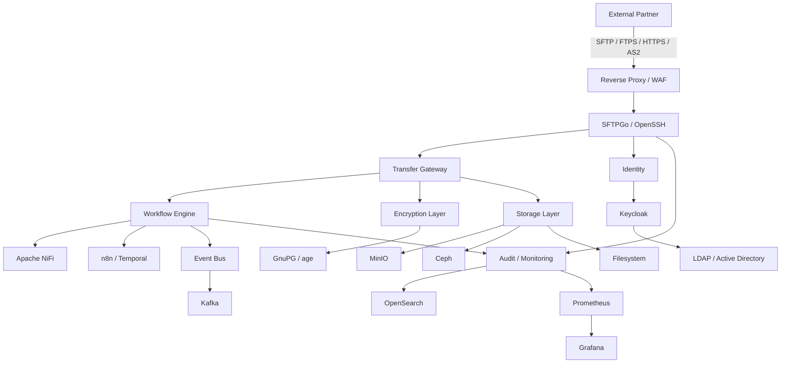
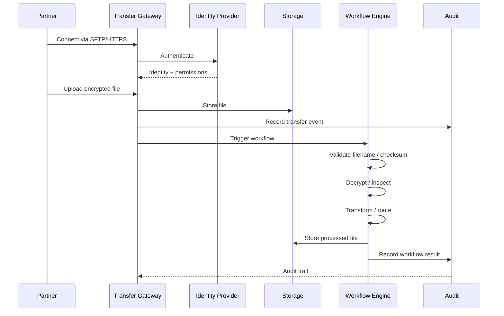
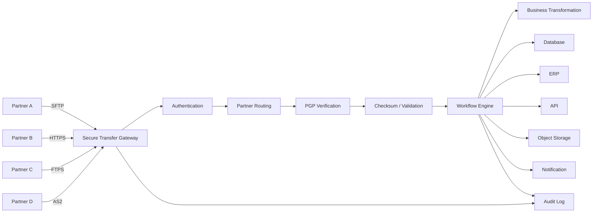
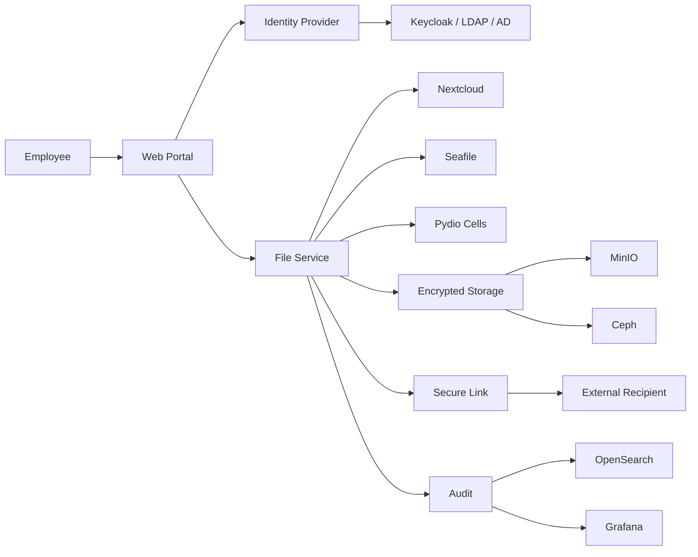
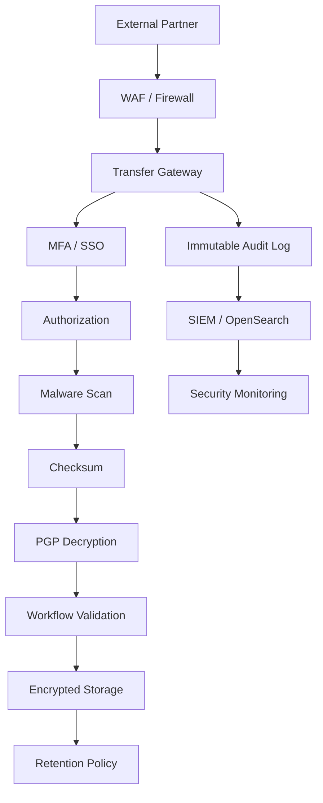

# Awesome-Secure-File-Transfer

## Top Secure File Transfer Platforms


A curated **GitHub-style reference list of enterprise Secure File Transfer / Managed File Transfer (MFT) platforms**, covering commercial SaaS/hosted products and open-source alternatives.


The primary emphasis is on **open-source software that can be self-hosted**, while keeping commercial SaaS/hosted platforms in a separate section.


Secure File Transfer is broader than simple FTP/SFTP. Modern MFT platforms typically combine:


* SFTP / FTPS / HTTPS / AS2 / AS4 / SCP

* Secure file exchange and sharing

* B2B partner connectivity

* Automated file workflows

* Scheduling and routing

* Encryption at rest and in transit

* PGP / OpenPGP

* Identity and access management

* MFA / SSO / LDAP / Active Directory

* Audit trails

* Data-loss prevention

* Retention and expiration policies

* API-based transfer

* Cloud object-storage integration

* Web portals and secure download links

* Event-driven automation

* High-volume batch transfer

* Compliance reporting

* HA / clustering / disaster recovery


> **Important:** An open-source SFTP server is not automatically an equivalent of a complete enterprise MFT suite. MOVEit, GoAnywhere, Kiteworks and IBM Sterling combine transfer protocols with workflow orchestration, partner management, auditing, governance, security and compliance. Open-source deployments generally require several components to reproduce that full capability.


---


## Table of Contents


* [SaaS/Hosted Platforms](#saashosted-platforms)

* [Open-Source](#open-source)


  * [Enterprise MFT / Secure Transfer Servers](#enterprise-mft--secure-transfer-servers)

  * [Secure File Sharing & Collaboration](#secure-file-sharing--collaboration)

  * [Peer-to-Peer / End-to-End Encrypted Transfer](#peer-to-peer--end-to-end-encrypted-transfer)

  * [File Synchronization](#file-synchronization)

  * [FTP / FTPS / SFTP Building Blocks](#ftp--ftps--sftp-building-blocks)

  * [Workflow & Automation](#workflow--automation)

  * [Encryption / PGP / Cryptography](#encryption--pgp--cryptography)

  * [Identity & Access Management](#identity--access-management)

  * [Object Storage](#object-storage)

  * [Monitoring & Observability](#monitoring--observability)

* [Commercial → Open-Source Mapping](#commercial--open-source-mapping)

* [Reference Architecture](#reference-architecture)

* [Typical Secure File Transfer Workflow](#typical-secure-file-transfer-workflow)

* [B2B MFT Workflow](#b2b-mft-workflow)

* [Secure File Sharing Workflow](#secure-file-sharing-workflow)

* [Capability Matrix](#capability-matrix)

* [Recommended Open-Source Stacks](#recommended-open-source-stacks)

* [What Open Source Can and Cannot Replace](#what-open-source-can-and-cannot-replace)

* [Why Open Source Is Attractive](#why-open-source-is-attractive)

* [Security & Compliance Considerations](#security--compliance-considerations)

* [Conclusion](#conclusion)

* [Contributing](#contributing)

* [Disclaimer](#disclaimer)


---


# SaaS/Hosted Platforms


These are **commercial platforms** and are kept separate from the open-source ecosystem.


| Platform                                                                                                       | Primary Focus                 | Typical Strengths                                                |

| -------------------------------------------------------------------------------------------------------------- | ----------------------------- | ---------------------------------------------------------------- |

| [Progress MOVEit](https://www.progress.com/moveit)                                                             | Enterprise MFT                | Secure transfers, automation, compliance, auditing               |

| [Kiteworks](https://www.kiteworks.com/)                                                                        | Secure content communications | Secure file sharing, governance, compliance, email/file transfer |

| [Fortra GoAnywhere MFT](https://www.goanywhere.com/)                                                           | Enterprise MFT                | Multi-protocol transfer, automation, workflows, B2B              |

| [Cleo Integration Cloud](https://www.cleo.com/)                                                                | Integration + MFT             | B2B integration, APIs, EDI, workflows                            |

| [Files.com](https://www.files.com/)                                                                            | Cloud file operations         | Secure file sharing, SFTP, automation, APIs                      |

| [GlobalSCAPE EFT](https://www.globalscape.com/eft)                                                             | Enterprise MFT                | Secure transfer, automation, workflow and compliance             |

| [Citrix ShareFile](https://www.sharefile.com/)                                                                 | Secure file sharing           | Business collaboration, secure links, client portals             |

| [IBM Sterling File Transfer](https://www.ibm.com/products/sterling-file-transfer)                              | Enterprise MFT                | Large-scale B2B transfers, partner management, automation        |

| [Axway Managed File Transfer](https://www.axway.com/en/products/managed-file-transfer)                         | Enterprise MFT                | B2B exchange, governance, API/integration ecosystem              |

| [Thru](https://www.thruinc.com/)                                                                               | Cloud MFT                     | Secure file exchange, automation, APIs                           |

| [JSCAPE MFT Server](https://www.jscape.com/)                                                                   | MFT                           | Multi-protocol transfer, automation, hybrid deployment           |

| [Redwood MFT](https://www.redwood.com/)                                                                        | MFT / automation              | Managed transfer and workload automation                         |

| [AWS Transfer Family](https://aws.amazon.com/aws-transfer-family/)                                             | Cloud SFTP/FTPS/FTP           | Managed endpoints connected to S3/EFS                            |

| [Azure Blob SFTP](https://learn.microsoft.com/en-us/azure/storage/blobs/secure-file-transfer-protocol-support) | Cloud SFTP                    | SFTP directly against Azure Blob Storage                         |

| [Google Cloud Storage SFTP solutions](https://cloud.google.com/storage)                                        | Cloud storage transfer        | Cloud-native secure transfer architectures                       |

| [SFTP To Go](https://sftptogo.com/)                                                                            | Cloud MFT                     | Managed SFTP/FTPS/HTTPS, object storage integration              |

| [Couchdrop](https://www.couchdrop.io/)                                                                         | Cloud SFTP                    | SFTP gateway to cloud storage                                    |

| [ExaVault](https://www.exavault.com/)                                                                          | Cloud file transfer           | Secure file sharing and SFTP                                     |

| [SmartFile](https://www.smartfile.com/)                                                                        | Secure file transfer          | SFTP, file sharing, automation                                   |

| [FilesAnywhere](https://www.filesanywhere.com/)                                                                | Secure file sharing           | Business file storage and sharing                                |

| [Titan MFT](https://titanftp.com/)                                                                             | Secure file transfer          | SFTP/FTP/FTPS and enterprise transfer                            |

| [Cerberus FTP Server](https://www.cerberusftp.com/)                                                            | Secure file server            | SFTP, FTPS, HTTPS and managed transfer                           |

| [SolarWinds Serv-U](https://www.solarwinds.com/serv-u)                                                         | MFT / file transfer           | SFTP, FTPS, HTTPS, automation                                    |

| [Cleo Harmony](https://www.cleo.com/products/harmony)                                                          | B2B integration               | EDI, APIs, MFT and partner workflows                             |

| [Axway SecureTransport](https://www.axway.com/en/products/securetransport)                                     | Enterprise MFT                | Secure partner file exchange                                     |

| [IBM Sterling File Gateway](https://www.ibm.com/products/sterling-file-gateway)                                | B2B gateway                   | Partner onboarding and high-volume transfer                      |

| [Oracle Managed File Transfer](https://www.oracle.com/integration/managed-file-transfer/)                      | Enterprise MFT                | Workflow, transfer and integration                               |

| [SAP Integration Suite](https://www.sap.com/products/technology-platform/integration-suite.html)               | Integration / MFT             | Enterprise integration and B2B connectivity                      |

| [Red Hat Integration](https://www.redhat.com/en/technologies/cloud-computing/integration)                      | Integration                   | API, messaging and integration workflows                         |

| [Boomi](https://boomi.com/)                                                                                    | Integration                   | B2B, API and data integration                                    |

| [MuleSoft Anypoint Platform](https://www.mulesoft.com/platform/anypoint-platform)                              | Integration                   | APIs, B2B and application integration                            |

| [Workato](https://www.workato.com/)                                                                            | Automation / integration      | Workflow automation and enterprise integrations                  |


### Commercial Platform Categories


```text

Enterprise MFT

├── Progress MOVEit

├── GoAnywhere MFT

├── IBM Sterling

├── Axway MFT

├── GlobalSCAPE EFT

├── JSCAPE

└── Redwood MFT


Secure Content / File Sharing

├── Kiteworks

├── Citrix ShareFile

├── Files.com

├── Thru

└── FilesAnywhere


Integration-Centric MFT

├── Cleo

├── MuleSoft

├── Boomi

├── Workato

├── SAP Integration Suite

└── Oracle MFT


Cloud-Native Transfer

├── AWS Transfer Family

├── Azure Blob SFTP

├── SFTP To Go

└── Couchdrop

```


---


# Open-Source


The open-source ecosystem is considerably more fragmented than the commercial MFT market.


Instead of one project replacing every capability of MOVEit or GoAnywhere, a production-grade open-source architecture may combine:


```text

SFTPGo / OpenSSH

        +

Nextcloud / Seafile / Pydio Cells

        +

OpenPGP / GnuPG

        +

n8n / Node-RED / Apache NiFi

        +

MinIO / Ceph

        +

Keycloak

        +

PostgreSQL

        +

Prometheus / Grafana

```


---


# Enterprise MFT / Secure Transfer Servers


## 1. SFTPGo


**Repository:** https://github.com/drakkan/sftpgo


One of the strongest open-source candidates for an MFT-oriented deployment.


SFTPGo provides SFTP, HTTP/S, FTP/S and WebDAV, with support for local storage and cloud/object-storage backends including S3-compatible storage, Google Cloud Storage and Azure Blob Storage. Its community edition is AGPLv3.


### Highlights


* SFTP

* HTTP/S

* FTP/S

* WebDAV

* WebAdmin

* WebClient

* Local filesystem

* Encrypted local filesystem

* S3-compatible storage

* Google Cloud Storage

* Azure Blob

* SFTP backend

* Event-driven architecture

* User/group management

* Virtual folders

* REST APIs

* Authentication controls

* Transfer automation


**Best OSS candidate for:**

`MOVEit / GoAnywhere-style secure transfer server`


---


## 2. OpenSSH / SFTP


**Project:** https://www.openssh.com/

**Repository:** https://github.com/openssh/openssh-portable


The foundational open-source SSH/SFTP infrastructure used throughout the industry.


### Highlights


* SFTP

* SCP

* SSH

* Public-key authentication

* Chroot environments

* Strong cryptography

* Unix/Linux integration

* Automation through SSH

* Extremely mature ecosystem


**Best for:** infrastructure-level secure transfer.


**Limitation:** OpenSSH by itself is not an enterprise MFT suite.


---


## 3. ProFTPD


**Repository:** https://github.com/proftpd/proftpd


A mature open-source FTP server with TLS and SFTP-related capabilities. The project is GPL-2.0 licensed.


### Useful for


* FTP

* FTPS

* SFTP integration

* LDAP

* SQL authentication

* Virtual users

* Modular deployment


---


## 4. vsftpd


https://security.appspot.com/vsftpd.html


A lightweight and security-focused FTP server.


### Useful for


* FTP

* FTPS

* Linux infrastructure

* High-performance file serving

* Minimal deployments


---


## 5. Pure-FTPd


https://www.pureftpd.org/


Open-source FTP/FTPS server focused on security and ease of administration.


---


## 6. Apache Mina SSHD


https://github.com/apache/mina-sshd


Java SSH/SFTP implementation useful for embedding secure transfer capabilities into applications.


### Best for


* Java applications

* Embedded SFTP

* SSH automation

* Custom MFT platforms


---


## 7. Apache Commons VFS


https://github.com/apache/commons-vfs


Virtual File System abstraction supporting multiple storage and transfer protocols.


Useful as an **application integration layer**, rather than a complete MFT server.


---


# Secure File Sharing & Collaboration


These projects are particularly relevant to **Kiteworks, Citrix ShareFile, Files.com and Thru-style secure file-sharing use cases**.


---


## 8. Nextcloud


https://github.com/nextcloud/server


https://nextcloud.com/


One of the largest open-source self-hosted file-sharing and collaboration ecosystems.


### Features


* File upload/download

* Public sharing links

* Password-protected links

* Expiration

* User/group sharing

* Federated sharing

* Versioning

* Web interface

* Desktop clients

* Mobile clients

* Encryption capabilities

* Workflow automation

* LDAP/AD integration

* SSO

* Extensive application ecosystem


Nextcloud's file-sharing model supports public links, users, groups and federation.


**Best OSS equivalent for:**

`Citrix ShareFile / secure collaboration`


---


## 9. Seafile


https://github.com/haiwen/seafile


https://www.seafile.com/


High-performance open-source file synchronization and sharing.


### Features


* File synchronization

* Secure sharing

* Public links

* Upload links

* Version control

* Client-side encryption

* Selective synchronization

* Block-level transfer

* Virtual drive

* Team collaboration


Seafile specifically supports encrypted libraries, password-protected download links, upload links, versioning and client-side encryption.


**Best for:** high-performance private file sharing.


---


## 10. Pydio Cells


https://github.com/pydio/cells


https://pydio.com/


An open-source self-hosted content collaboration platform built around secure document sharing and organizational workflows.


### Features


* Secure file sharing

* Large-file transfer

* Granular permissions

* User management

* Workflow automation

* Web interface

* Organizational collaboration

* Self-hosting

* Compliance-oriented deployments


Pydio describes Cells as an open-source self-hosted document-sharing and collaboration platform designed for organizations requiring granular security and control.


**Best for:**

`Kiteworks / ShareFile-style secure content collaboration`


---


## 11. FileGator


https://github.com/filegator/filegator


A lightweight open-source self-hosted web file manager.


### Features


* Multi-user

* Roles

* Home directories

* Upload/download

* Drag-and-drop

* Chunked uploads

* Pause/resume

* File preview

* ZIP support

* Storage adapters


FileGator explicitly supports multi-user permissions and chunked uploads with pause/resume.


**Best for:** lightweight secure browser-based file transfer.


---


## 12. ProjectSend


https://github.com/muriaga/ProjectSend


https://www.projectsend.org/


Open-source client-oriented file-sharing platform.


### Features


* Client accounts

* Client groups

* File assignment

* Expiration

* Upload/download

* Notifications

* Detailed logs

* Multiple languages

* Privacy-focused sharing


ProjectSend is GPLv2 licensed.


**Best for:** client-facing secure file exchange.


---


## 13. ownCloud


https://github.com/owncloud/core


https://owncloud.com/


Open-source file synchronization and sharing platform.


### Useful for


* Secure file sharing

* File synchronization

* External storage

* User/group management

* Federation

* Enterprise collaboration

* Self-hosted deployments


---


## 14. Cozy


https://github.com/cozy/cozy


A self-hosted personal cloud ecosystem with file-storage capabilities.


---


## 15. Filestash


https://github.com/mickael-kerjean/filestash


Web-based file manager that can connect to multiple storage backends.


### Useful for


* Browser-based access

* SFTP

* S3

* FTP

* WebDAV

* Multiple backend integration


---


# Peer-to-Peer / End-to-End Encrypted Transfer


These projects are not traditional MFT suites, but they are excellent open-source alternatives for **secure ad-hoc file transfer**.


---


## 16. Magic Wormhole


https://github.com/magic-wormhole/magic-wormhole


A mature secure file-transfer protocol/tool using short, human-readable one-time codes.


It can transfer files/directories between machines and uses encrypted communication; the project is MIT licensed.


### Best for


* Ad-hoc secure transfer

* Large files

* Developer workflows

* No-account transfer

* End-to-end encrypted exchange


---


## 17. croc


https://github.com/schollz/croc


Simple secure file transfer between computers.


### Features


* End-to-end encryption

* PAKE-based key establishment

* File/folder transfer

* Relay support

* Encrypted temporary storage

* CLI workflow


The project uses password-authenticated key agreement to establish encryption keys and can use encrypted temporary storage when direct transfer is inconvenient.


---


## 18. Wormhole App


https://github.com/wormhole-app/wormhole


A graphical cross-platform application based on the Magic Wormhole protocol.


### Platforms


* Android

* iOS

* macOS

* Windows


The project is GPLv3 licensed.


---


## 19. Destiny


https://github.com/LeastAuthority/destiny


A graphical Magic Wormhole client emphasizing identity-less end-to-end encrypted file transfer.


### Features


* End-to-end encryption

* No account required

* Peer-to-peer transfer

* Identity minimization

* Cross-platform GUI


---


## 20. Arvolo


https://github.com/lords82/arvolo


A newer self-hostable secure file-transfer project designed around peer-to-peer transfer and encrypted relay storage.


### Interesting concept


```text

Sender

   │

   ├── Recipient online

   │        ↓

   │     P2P transfer

   │

   └── Recipient offline

            ↓

       E2E-encrypted relay

            ↓

       Recipient downloads

            ↓

       Ciphertext expires

```


---


## 21. LocalSend


https://github.com/localsend/localsend


Open-source local-network file transfer.


### Best for


* LAN transfer

* Desktop/mobile sharing

* No central cloud

* Simple device-to-device exchange


---


## 22. PairDrop


https://github.com/schlagmichdoch/PairDrop


Browser-based local and peer-to-peer file transfer inspired by AirDrop.


---


## 23. Warpinator


https://github.com/linuxmint/warpinator


Simple LAN file transfer application originally developed by Linux Mint.


---


# File Synchronization


## 24. Syncthing


https://github.com/syncthing/syncthing


https://syncthing.net/


Open-source continuous peer-to-peer file synchronization.


Syncthing uses cryptographic device identities and encrypted communication and is maintained by the Syncthing Foundation.


### Features


* Continuous synchronization

* Peer-to-peer

* TLS-encrypted communication

* Device identity

* Versioning

* Folder synchronization

* No central cloud requirement


**Best for:**

`secure continuous synchronization`


**Not a direct MFT replacement:** it is primarily synchronization rather than enterprise partner-transfer management.


---


## 25. rsync


https://github.com/WayneD/rsync


One of the foundational open-source file synchronization and transfer utilities.


### Features


* Incremental transfer

* Delta synchronization

* SSH transport

* Automation

* Backup workflows

* High efficiency


---


## 26. Rclone


https://github.com/rclone/rclone


"rsync for cloud storage."


### Supports


* S3

* Azure Blob

* Google Cloud Storage

* SFTP

* WebDAV

* FTP

* SMB

* Local storage

* Many other backends


**Best for:** cloud-storage transfer automation and data movement.


---


# FTP / FTPS / SFTP Building Blocks


| Project                                                 | Main Role            | Best Use                         |

| ------------------------------------------------------- | -------------------- | -------------------------------- |

| [OpenSSH](https://github.com/openssh/openssh-portable)  | SSH/SFTP             | Secure server-to-server transfer |

| [SFTPGo](https://github.com/drakkan/sftpgo)             | MFT server           | Enterprise-style SFTP            |

| [ProFTPD](https://github.com/proftpd/proftpd)           | FTP/FTPS             | Traditional FTP infrastructure   |

| [vsftpd](https://security.appspot.com/vsftpd.html)      | FTP/FTPS             | Lightweight secure FTP           |

| [Pure-FTPd](https://www.pureftpd.org/)                  | FTP/FTPS             | Secure FTP                       |

| [Apache Mina SSHD](https://github.com/apache/mina-sshd) | SSH/SFTP library     | Java applications                |

| [Rclone](https://github.com/rclone/rclone)              | Data transfer        | Cloud/SFTP automation            |

| [rsync](https://github.com/WayneD/rsync)                | File synchronization | Incremental transfers            |

| [LFTP](https://github.com/lavv17/lftp)                  | FTP/SFTP client      | Automated transfer               |

| [curl](https://github.com/curl/curl)                    | Transfer client      | HTTP/SFTP/FTP automation         |

| [Wget](https://www.gnu.org/software/wget/)              | HTTP/FTP client      | Automated downloads              |


---


# Workflow & Automation


A major difference between a simple SFTP server and an enterprise MFT system is **workflow orchestration**.


---


## 27. Apache NiFi


https://github.com/apache/nifi


https://nifi.apache.org/


One of the strongest open-source building blocks for enterprise data-flow automation.


### Features


* Visual workflows

* File ingestion

* Routing

* Transformation

* Encryption/decryption

* SFTP processors

* HTTP

* S3

* Kafka

* Database connectivity

* Retry logic

* Back-pressure

* Provenance

* Monitoring


**Excellent for:** reproducing the workflow/automation portion of commercial MFT.


---


## 28. n8n


https://github.com/n8n-io/n8n


Workflow automation platform.


### Useful for


* File arrival triggers

* SFTP workflows

* API calls

* Notifications

* Cloud storage

* Email

* Webhooks

* Scheduled transfers

* Business automation


---


## 29. Node-RED


https://github.com/node-red/node-red


Flow-based programming for event-driven automation.


---


## 30. Windmill


https://github.com/windmill-labs/windmill


Open-source workflow automation and developer platform.


---


## 31. Kestra


https://github.com/kestra-io/kestra


Open-source orchestration platform useful for scheduled and event-driven file-processing pipelines.


---


## 32. Apache Airflow


https://github.com/apache/airflow


Excellent for scheduled batch workflows and data pipelines.


---


## 33. Temporal


https://github.com/temporalio/temporal


Durable workflow orchestration.


### Useful for


* Reliable transfer workflows

* Retries

* Long-running jobs

* Partner workflows

* Failure recovery

* Exactly-once-style business orchestration


---


# Encryption / PGP / Cryptography


## 34. GnuPG


https://github.com/gpg/gnupg


https://gnupg.org/


The foundational open-source OpenPGP implementation.


### Useful for


* File encryption

* File decryption

* Digital signatures

* Key management

* Partner-to-partner encrypted files


---


## 35. age


https://github.com/FiloSottile/age


Modern simple file encryption tool.


### Best for


* Developer workflows

* Automated pipelines

* Scriptable encryption

* Backup encryption


---


## 36. OpenSSL


https://github.com/openssl/openssl


Core cryptographic library used throughout secure networking infrastructure.


---


## 37. libsodium


https://github.com/jedisct1/libsodium


Modern cryptographic library suitable for secure application development.


---


# Identity & Access Management


Secure file transfer becomes significantly more useful when integrated with centralized identity.


## 38. Keycloak


https://github.com/keycloak/keycloak


https://www.keycloak.org/


Open-source IAM platform.


### Features


* SSO

* OAuth 2.0

* OpenID Connect

* SAML

* LDAP

* Active Directory

* MFA

* Roles

* Groups

* Identity brokering


---


## 39. Authentik


https://github.com/goauthentik/authentik


Open-source identity provider and access-management platform.


---


## 40. Authelia


https://github.com/authelia/authelia


Open-source authentication and authorization server.


---


## 41. FreeIPA


https://www.freeipa.org/


Identity management solution integrating:


* LDAP

* Kerberos

* DNS

* Certificates

* Policy


---


# Object Storage


Modern MFT architectures increasingly separate the **transfer protocol** from the **storage layer**.


---


## 42. MinIO


https://github.com/minio/minio


S3-compatible object storage.


### Excellent combination


```text

SFTPGo

   │

   ▼

MinIO

   │

   ├── Object Storage

   ├── Versioning

   ├── Replication

   └── Encryption

```


---


## 43. Ceph


https://github.com/ceph/ceph


Distributed storage platform supporting object, block and file storage.


---


## 44. OpenStack Swift


https://github.com/openstack/swift


Distributed object-storage platform.


---


## 45. SeaweedFS


https://github.com/seaweedfs/seaweedfs


Distributed storage system with file and object-storage capabilities.


---


# Monitoring & Observability


## 46. Prometheus


https://github.com/prometheus/prometheus


Metrics collection and alerting.


---


## 47. Grafana


https://github.com/grafana/grafana


Visualization, dashboards and operational monitoring.


---


## 48. Loki


https://github.com/grafana/loki


Log aggregation.


---


## 49. OpenSearch


https://github.com/opensearch-project/OpenSearch


Search and analytics platform useful for:


* Transfer logs

* Audit events

* Security analytics

* Searchable operational history


---


## 50. OpenTelemetry


https://github.com/open-telemetry/opentelemetry-collector


Vendor-neutral observability framework.


---


# Commercial → Open-Source Mapping


| Commercial Platform    | Closest Open-Source Direction                |

| ---------------------- | -------------------------------------------- |

| Progress MOVEit        | **SFTPGo + Apache NiFi + Keycloak + GnuPG**  |

| GoAnywhere MFT         | **SFTPGo + NiFi + n8n + MinIO**              |

| Kiteworks              | **Pydio Cells + Keycloak + MinIO**           |

| Cleo Integration Cloud | **Apache NiFi + SFTPGo + Kafka + Keycloak**  |

| Files.com              | **SFTPGo + Nextcloud + MinIO**               |

| GlobalSCAPE EFT        | **SFTPGo + OpenSSH + NiFi**                  |

| Citrix ShareFile       | **Nextcloud / Seafile / Pydio Cells**        |

| IBM Sterling           | **SFTPGo + NiFi + Kafka + Keycloak + MinIO** |

| Axway MFT              | **SFTPGo + NiFi + Keycloak + MinIO**         |

| Thru                   | **Nextcloud / Pydio Cells + SFTPGo + MinIO** |

| AWS Transfer Family    | **SFTPGo + MinIO / Ceph**                    |

| Secure ad-hoc transfer | **Magic Wormhole / croc / LocalSend**        |

| Secure synchronization | **Syncthing / rsync**                        |


---


# Reference Architecture


A serious open-source enterprise MFT platform can be assembled as follows:





---


# Typical Secure File Transfer Workflow





---


# B2B MFT Workflow





---


# Secure File Sharing Workflow





---


# Capability Matrix


| Capability             | MOVEit | GoAnywhere |      Kiteworks |               SFTPGo | Nextcloud |  Seafile |        Pydio Cells |       OpenSSH |

| ---------------------- | -----: | ---------: | -------------: | -------------------: | --------: | -------: | -----------------: | ------------: |

| SFTP                   |      ✅ |          ✅ |              ✅ |                    ✅ |        ⚠️ |       ⚠️ |                 ⚠️ |             ✅ |

| FTPS                   |      ✅ |          ✅ |              ✅ |                    ✅ |        ⚠️ |       ⚠️ |                 ⚠️ |             ❌ |

| HTTPS                  |      ✅ |          ✅ |              ✅ |                    ✅ |         ✅ |        ✅ |                  ✅ |            ⚠️ |

| Web portal             |      ✅ |          ✅ |              ✅ |                    ✅ |         ✅ |        ✅ |                  ✅ |             ❌ |

| Secure links           |      ✅ |          ✅ |              ✅ |                    ✅ |         ✅ |        ✅ |                  ✅ |             ❌ |

| User management        |      ✅ |          ✅ |              ✅ |                    ✅ |         ✅ |        ✅ |                  ✅ |         Basic |

| MFA                    |      ✅ |          ✅ |              ✅ |         Configurable |         ✅ |        ✅ |                  ✅ | Via ecosystem |

| SSO                    |      ✅ |          ✅ |              ✅ |         Configurable |         ✅ |        ✅ |                  ✅ |      External |

| LDAP/AD                |      ✅ |          ✅ |              ✅ |                    ✅ |         ✅ |        ✅ |                  ✅ |             ✅ |

| PGP                    |      ✅ |          ✅ |              ✅ |   Workflow-dependent |  Via apps | Via apps | Workflow-dependent |      External |

| Automation             |      ✅ |          ✅ |              ✅ |                    ✅ |         ✅ |        ✅ |                  ✅ |    Scriptable |

| Workflow engine        |      ✅ |          ✅ |              ✅ |              Partial |      Apps |  Partial |                  ✅ |             ❌ |

| B2B partner management |      ✅ |          ✅ |              ✅ |              Partial |   Partial |  Partial |            Partial |             ❌ |

| Audit trail            |      ✅ |          ✅ |              ✅ |                    ✅ |         ✅ |        ✅ |                  ✅ |       OS logs |

| Object storage         |      ✅ |          ✅ |              ✅ |                    ✅ |         ✅ |        ✅ |                  ✅ |     Via tools |

| Versioning             |      ✅ |          ✅ |              ✅ |    Backend-dependent |         ✅ |        ✅ |                  ✅ |             ❌ |

| HA / clustering        |      ✅ |          ✅ |              ✅ | Deployment-dependent |         ✅ |        ✅ |                  ✅ |      External |

| Open source            |      ❌ |          ❌ |              ❌ |                **✅** |     **✅** |    **✅** |              **✅** |         **✅** |

| Self-hostable          |      ✅ |          ✅ | Limited/varies |                **✅** |     **✅** |    **✅** |              **✅** |         **✅** |


> `⚠️` indicates that the capability may be achieved through integrations, extensions or additional components rather than being the project's primary purpose.


---


# Recommended Open-Source Stacks


## 1. Best Overall Open-Source MFT Stack


```text

SFTPGo

   +

Apache NiFi

   +

Keycloak

   +

GnuPG

   +

MinIO

   +

PostgreSQL

   +

OpenSearch

   +

Prometheus

   +

Grafana

```


### Why?


This combination provides:


* Secure transfer

* Web administration

* SFTP

* FTPS

* HTTPS

* Identity

* Encryption

* Object storage

* Workflow automation

* Audit

* Monitoring

* Searchable logs


---


# 2. MOVEit / GoAnywhere Alternative


```text

                 ┌───────────────────┐

                 │     Keycloak      │

                 │ SSO / MFA / LDAP  │

                 └─────────┬─────────┘

                           │

                           ▼

┌─────────────┐     ┌──────────────┐

│   Partner   │────▶│    SFTPGo    │

└─────────────┘     └──────┬───────┘

                           │

                           ▼

                    ┌─────────────┐

                    │ Apache NiFi │

                    └──────┬──────┘

                           │

             ┌─────────────┼─────────────┐

             ▼             ▼             ▼

          MinIO         GnuPG         Kafka

             │             │             │

             └─────────────┼─────────────┘

                           ▼

                    OpenSearch

                           │

                           ▼

                         Grafana

```


---


# 3. Kiteworks / ShareFile Alternative


```text

Nextcloud / Pydio Cells

          │

          ├── SSO

          ├── MFA

          ├── Sharing

          ├── Expiration

          ├── Permissions

          ├── Versioning

          └── Audit

                 │

                 ▼

          MinIO / Ceph

```


---


# 4. Lightweight SFTP Service


For organizations that only require secure file transfer:


```text

OpenSSH

   +

Linux

   +

LDAP / Keycloak

   +

Filesystem / MinIO

   +

Prometheus

```


This is dramatically simpler than deploying a full MFT platform.


---


# 5. Developer / Ad-Hoc Secure Transfer


```text

Magic Wormhole

       +

croc

       +

LocalSend

       +

age

```


Best for:


* Developers

* Temporary transfers

* Incident response

* Remote support

* One-time secure exchanges


---


# 6. Secure Cloud-Storage Gateway


```text

                Internet

                   │

                   ▼

                SFTPGo

                   │

        ┌──────────┼──────────┐

        ▼          ▼          ▼

      MinIO       S3      Azure Blob

```


This architecture can provide a secure SFTP interface over modern object storage.


---


# 7. Fully Open-Source Enterprise MFT Blueprint


```text

                         Internet

                            │

                     ┌──────▼──────┐

                     │  Cloudflare │

                     │ / WAF / LB  │

                     └──────┬──────┘

                            │

                    ┌───────▼────────┐

                    │  SFTPGo Nodes  │

                    │ HA / Transfer  │

                    └───────┬────────┘

                            │

           ┌────────────────┼─────────────────┐

           │                │                 │

           ▼                ▼                 ▼

       Keycloak           NiFi              MinIO

       IAM / MFA         Workflow          Storage

           │                │                 │

           │          ┌─────┴─────┐           │

           │          ▼           ▼           │

           │        Kafka       GnuPG         │

           │          │           │           │

           └──────────┴───────────┴───────────┘

                            │

                            ▼

                       OpenSearch

                            │

                            ▼

                         Grafana

```


---


# Open-Source Ecosystem by Layer


```text

                    SECURE FILE TRANSFER

                            │

        ┌───────────────────┼───────────────────┐

        │                   │                   │

        ▼                   ▼                   ▼

    MFT SERVER        FILE SHARING          P2P TRANSFER

        │                   │                   │

    SFTPGo             Nextcloud          Magic Wormhole

    OpenSSH             Seafile                croc

    ProFTPD             Pydio Cells         LocalSend

        │                   │                   │

        └───────────────────┼───────────────────┘

                            │

                            ▼

                       WORKFLOW

                            │

                ┌───────────┼───────────┐

                ▼           ▼           ▼

              NiFi         n8n       Temporal

                │

                ▼

                       ENCRYPTION

                            │

                    ┌───────┴───────┐

                    ▼               ▼

                   GnuPG           age

                    │

                    ▼

                       STORAGE

                            │

                ┌───────────┼───────────┐

                ▼           ▼           ▼

              MinIO        Ceph      SeaweedFS

                            │

                            ▼

                       OBSERVABILITY

                            │

                ┌───────────┼───────────┐

                ▼           ▼           ▼

           OpenSearch   Prometheus    Grafana

```


---


# What Open Source Can and Cannot Replace


## Can Replace


Open-source software can replace many individual capabilities of commercial MFT products:


* SFTP server

* FTPS server

* HTTPS file portal

* Secure file sharing

* File synchronization

* Object storage

* PGP encryption

* Authentication

* MFA

* Workflow automation

* Event-driven processing

* Audit logging

* Monitoring

* Cloud-storage gateways

* API-driven transfers

* Scheduled transfers

* File validation

* Notifications

* Data routing

* Transformation pipelines


---


## More Difficult to Reproduce


The following capabilities are considerably harder to reproduce as a polished integrated product:


### 1. Enterprise Partner Management


Commercial MFT products often provide sophisticated:


* Partner onboarding

* Trading-partner profiles

* Protocol configuration

* Certificates

* Partner-specific routing

* SLA management

* Partner dashboards


---


### 2. Integrated Compliance


Commercial products may package:


* Compliance reports

* Audit evidence

* Policy management

* Retention policies

* Governance controls

* Vendor support

* Enterprise certifications


An open-source stack can provide the technology, but the organization remains responsible for configuration, hardening, validation and compliance evidence.


---


### 3. Single-Pane Administration


Commercial MFT:


```text

One Product

    │

    ├── Users

    ├── Partners

    ├── Transfers

    ├── Workflows

    ├── Encryption

    ├── Audit

    ├── Reports

    └── Monitoring

```


Open source:


```text

SFTPGo

  +

NiFi

  +

Keycloak

  +

GnuPG

  +

MinIO

  +

OpenSearch

  +

Grafana

```


The latter provides enormous flexibility but requires integration and operational expertise.


---


# Why Open Source Is Attractive


## 1. No Vendor Lock-In


You control:


* Infrastructure

* Storage

* Configuration

* Encryption

* Identity

* Data

* Deployment


---


## 2. Self-Hosting


Useful for organizations that cannot place sensitive files entirely in a third-party SaaS environment.


---


## 3. Architecture Freedom


You can choose:


```text

Storage

├── MinIO

├── Ceph

├── S3

├── Azure Blob

└── Filesystem


Identity

├── Keycloak

├── LDAP

├── AD

└── Authentik


Workflow

├── NiFi

├── n8n

├── Temporal

├── Airflow

└── Node-RED

```


---


## 4. Automation


Open-source tools can be connected into highly sophisticated pipelines.


```text

File Arrives

     ↓

Authenticate

     ↓

Validate

     ↓

Checksum

     ↓

Decrypt

     ↓

Scan

     ↓

Transform

     ↓

Route

     ↓

Store

     ↓

Notify

     ↓

Audit

```


---


## 5. Cloud Independence


A self-hosted stack can run on:


* Bare metal

* VMware

* Kubernetes

* Docker

* OpenStack

* AWS

* Azure

* Google Cloud

* Private cloud


---


# Security & Compliance Considerations


Secure file transfer should be designed as a **security system**, not simply an SFTP endpoint.


## Minimum Security Controls


```text

Encryption in Transit

        +

Encryption at Rest

        +

Strong Authentication

        +

MFA

        +

Least Privilege

        +

Network Segmentation

        +

Malware Scanning

        +

Audit Logging

        +

Key Management

        +

Backup

        +

Disaster Recovery

        +

Patch Management

```


---


## Recommended Security Architecture





---


# Protocol Coverage


A mature open-source MFT deployment can potentially support:


| Protocol        | Open-Source Options                         |

| --------------- | ------------------------------------------- |

| SFTP            | OpenSSH, SFTPGo, ProFTPD                    |

| SCP             | OpenSSH                                     |

| FTP             | ProFTPD, vsftpd, Pure-FTPd                  |

| FTPS            | ProFTPD, vsftpd, Pure-FTPd, SFTPGo          |

| HTTPS           | Nextcloud, Pydio, Seafile, SFTPGo           |

| WebDAV          | SFTPGo, Nextcloud                           |

| S3              | MinIO, Ceph, Rclone                         |

| AS2             | Apache Camel / specialized OSS integrations |

| HTTP APIs       | curl, Rclone, custom services               |

| P2P             | Magic Wormhole, croc, LocalSend             |

| Synchronization | Syncthing, rsync                            |


---


# Important Distinction: SFTP vs MFT


```text

SFTP

 │

 ├── Secure protocol

 ├── Authentication

 ├── File transfer

 └── Encryption

```


versus:


```text

MFT

 │

 ├── SFTP / FTPS / HTTPS / AS2

 ├── Partner management

 ├── Workflow automation

 ├── Scheduling

 ├── Routing

 ├── Transformation

 ├── Encryption

 ├── Identity

 ├── Audit

 ├── Monitoring

 ├── Compliance

 ├── HA

 └── Reporting

```


Therefore:


> **OpenSSH is an excellent secure-transfer building block, but SFTPGo is much closer to the MFT category.**


---


# Best Open-Source Choices by Requirement


| Requirement                             | Recommended OSS    |

| --------------------------------------- | ------------------ |

| Best overall MFT                        | **SFTPGo**         |

| Enterprise workflow                     | **Apache NiFi**    |

| Secure SFTP infrastructure              | **OpenSSH**        |

| Secure file sharing                     | **Nextcloud**      |

| High-performance file sync/share        | **Seafile**        |

| Secure enterprise content collaboration | **Pydio Cells**    |

| Lightweight web file manager            | **FileGator**      |

| Client-facing file exchange             | **ProjectSend**    |

| P2P secure transfer                     | **Magic Wormhole** |

| Simple encrypted transfer               | **croc**           |

| LAN transfer                            | **LocalSend**      |

| Continuous synchronization              | **Syncthing**      |

| Incremental synchronization             | **rsync**          |

| Cloud transfer                          | **Rclone**         |

| Encryption                              | **GnuPG / age**    |

| Identity                                | **Keycloak**       |

| Object storage                          | **MinIO**          |

| Distributed storage                     | **Ceph**           |

| Workflow automation                     | **n8n**            |

| Durable workflows                       | **Temporal**       |

| Data-flow automation                    | **Apache NiFi**    |

| Metrics                                 | **Prometheus**     |

| Dashboards                              | **Grafana**        |

| Log/search analytics                    | **OpenSearch**     |


---


# A Practical Open-Source MOVEit Alternative


For organizations specifically searching for a **MOVEit / GoAnywhere alternative without proprietary licensing**, the most interesting architecture is:


```text

                    ┌───────────────┐

                    │   Keycloak    │

                    │ IAM / MFA/SSO │

                    └───────┬───────┘

                            │

                            ▼

                    ┌───────────────┐

Partners ──────────▶│    SFTPGo     │

                    │ Transfer MFT  │

                    └───────┬───────┘

                            │

                            ▼

                    ┌───────────────┐

                    │ Apache NiFi   │

                    │  Workflows    │

                    └───────┬───────┘

                            │

             ┌──────────────┼───────────────┐

             ▼              ▼               ▼

          GnuPG           MinIO           Kafka

        Encryption        Storage          Events

             │              │               │

             └──────────────┼───────────────┘

                            ▼

                    ┌───────────────┐

                    │  OpenSearch   │

                    │ Audit / Logs  │

                    └───────┬───────┘

                            ▼

                        Grafana

```


This is not a drop-in clone of MOVEit, but it can reproduce a large proportion of the **technical functionality** using independently maintained open-source components.


---


# Open-Source Licensing Notes


Licenses matter greatly in an enterprise deployment.


Examples include:


| Project            | License / Model                                          |

| ------------------ | -------------------------------------------------------- |

| SFTPGo Community   | AGPLv3                                                   |

| OpenSSH            | BSD-style                                                |

| ProFTPD            | GPLv2                                                    |

| Nextcloud          | AGPLv3                                                   |

| Pydio Cells        | AGPLv3                                                   |

| ProjectSend        | GPLv2                                                    |

| Magic Wormhole     | MIT                                                      |

| Seafile components | Mixed open-source licenses                               |

| Apache NiFi        | Apache 2.0                                               |

| Keycloak           | Apache 2.0                                               |

| MinIO              | Check current repository/license terms before deployment |

| Grafana            | AGPLv3                                                   |

| Prometheus         | Apache 2.0                                               |

| OpenSearch         | Apache 2.0                                               |


Always verify the current license of the exact release and edition before incorporating software into a commercial product or managed service.


---


# OSS Architecture Patterns


## Pattern A — Simple SFTP


```text

Internet

   │

Firewall

   │

OpenSSH

   │

Filesystem

```


### Best for


Small organizations and machine-to-machine transfers.


---


## Pattern B — Managed SFTP


```text

Internet

   │

Load Balancer

   │

SFTPGo

   │

MinIO

```


### Best for


Cloud/object-storage-backed file exchange.


---


## Pattern C — Full MFT


```text

Partners

   │

SFTPGo

   │

NiFi

   │

GnuPG

   │

MinIO

   │

Kafka

   │

OpenSearch

   │

Grafana

```


### Best for


Enterprise B2B transfers.


---


## Pattern D — Secure Collaboration


```text

Users

  │

Nextcloud / Seafile / Pydio

  │

Keycloak

  │

MinIO / Ceph

```


### Best for


Human-to-human secure file sharing.


---


## Pattern E — Zero-Account Ad-Hoc Transfer


```text

Sender

  │

Magic Wormhole / croc

  │

Recipient

```


### Best for


One-time secure transfer.


---


# Open-Source Ecosystem Summary


```text

                    SECURE FILE TRANSFER

                             │

       ┌─────────────────────┼─────────────────────┐

       │                     │                     │

       ▼                     ▼                     ▼

      MFT                FILE SHARING             P2P

       │                     │                     │

   SFTPGo              Nextcloud             Magic Wormhole

   OpenSSH              Seafile                   croc

   ProFTPD              Pydio Cells            LocalSend

       │                 FileGator

       │                 ProjectSend

       │                     │

       └─────────────────────┼─────────────────────┘

                             │

                             ▼

                         WORKFLOW

                             │

                  ┌──────────┼──────────┐

                  ▼          ▼          ▼

                NiFi        n8n       Temporal

                  │

                  ▼

                       ENCRYPTION

                  ┌──────────┴──────────┐

                  ▼                     ▼

                GnuPG                   age

                  │

                  ▼

                         STORAGE

                  ┌──────────┼──────────┐

                  ▼          ▼          ▼

                MinIO       Ceph     SeaweedFS

                  │

                  ▼

                        OBSERVABILITY

                  ┌──────────┼──────────┐

                  ▼          ▼          ▼

             OpenSearch  Prometheus   Grafana

```


---


# Why SFTPGo Is Particularly Interesting


Among open-source projects, **SFTPGo stands out as one of the closest architectural fits for the secure-file-transfer/MFT category** because it is specifically designed around multiple transfer protocols, web administration, users, storage backends and event-driven transfer workflows rather than merely providing an FTP/SFTP daemon.


A particularly useful architecture is:


```text

             SFTPGo

                │

       ┌────────┼────────┐

       ▼        ▼        ▼

     SFTP      HTTPS    WebDAV

       │

       ▼

     Events

       │

       ▼

  Apache NiFi

       │

 ┌─────┼──────┐

 ▼     ▼      ▼

PGP   S3     APIs

```


---


# Open-Source Shortlist


If the objective is to investigate the **strongest open-source alternatives first**, the shortlist should be:


### Tier 1 — Directly Relevant


1. [SFTPGo](https://github.com/drakkan/sftpgo)

2. [OpenSSH](https://github.com/openssh/openssh-portable)

3. [Nextcloud](https://github.com/nextcloud/server)

4. [Seafile](https://github.com/haiwen/seafile)

5. [Pydio Cells](https://github.com/pydio/cells)

6. [Apache NiFi](https://github.com/apache/nifi)

7. [ProjectSend](https://github.com/muriaga/ProjectSend)

8. [FileGator](https://github.com/filegator/filegator)


### Tier 2 — Secure Transfer / Synchronization


9. [Syncthing](https://github.com/syncthing/syncthing)

10. [rsync](https://github.com/WayneD/rsync)

11. [Rclone](https://github.com/rclone/rclone)

12. [ProFTPD](https://github.com/proftpd/proftpd)

13. [Pure-FTPd](https://www.pureftpd.org/)

14. [vsftpd](https://security.appspot.com/vsftpd.html)


### Tier 3 — Secure Ad-Hoc Transfer


15. [Magic Wormhole](https://github.com/magic-wormhole/magic-wormhole)

16. [croc](https://github.com/schollz/croc)

17. [LocalSend](https://github.com/localsend/localsend)

18. [PairDrop](https://github.com/schlagmichdoch/PairDrop)

19. [Warpinator](https://github.com/linuxmint/warpinator)

20. [Destiny](https://github.com/LeastAuthority/destiny)


### Tier 4 — Supporting Infrastructure


21. [Keycloak](https://github.com/keycloak/keycloak)

22. [Authentik](https://github.com/goauthentik/authentik)

23. [GnuPG](https://github.com/gpg/gnupg)

24. [age](https://github.com/FiloSottile/age)

25. [MinIO](https://github.com/minio/minio)

26. [Ceph](https://github.com/ceph/ceph)

27. [Apache Kafka](https://github.com/apache/kafka)

28. [n8n](https://github.com/n8n-io/n8n)

29. [Temporal](https://github.com/temporalio/temporal)

30. [Node-RED](https://github.com/node-red/node-red)

31. [Prometheus](https://github.com/prometheus/prometheus)

32. [Grafana](https://github.com/grafana/grafana)

33. [OpenSearch](https://github.com/opensearch-project/OpenSearch)


---


# Conclusion


The commercial Secure File Transfer / MFT market is dominated by integrated platforms such as:


* Progress MOVEit

* GoAnywhere MFT

* Kiteworks

* Cleo

* Files.com

* GlobalSCAPE EFT

* Citrix ShareFile

* IBM Sterling

* Axway MFT

* Thru


Their major advantage is **integration**: transfer protocols, workflows, partner management, security, audit, compliance and administration are delivered as one product.


The open-source ecosystem takes a different approach.


The most compelling foundation for an open-source MFT platform is:


```text

                 SFTPGo

                    │

       ┌────────────┼────────────┐

       ▼            ▼            ▼

   Keycloak       NiFi         MinIO

       │            │            │

       └────────────┼────────────┘

                    ▼

                  GnuPG

                    │

                    ▼

               OpenSearch

                    │

                    ▼

                 Grafana

```


For secure collaboration:


```text

Nextcloud / Seafile / Pydio Cells

```


For continuous synchronization:


```text

Syncthing / rsync

```


For one-time encrypted transfer:


```text

Magic Wormhole / croc / LocalSend

```


For object-storage-backed transfer:


```text

SFTPGo + MinIO

```


For a serious enterprise MFT architecture:


```text

SFTPGo

+

Apache NiFi

+

Keycloak

+

GnuPG

+

MinIO

+

Kafka

+

OpenSearch

+

Prometheus

+

Grafana

```


This approach can provide a powerful, self-hosted and highly customizable alternative to proprietary MFT platforms, although it requires considerably more architecture, integration and operational responsibility than a commercial all-in-one product.


---


# Contributing


Contributions are welcome.


Useful contributions include:


* New open-source MFT projects

* Secure SFTP servers

* Open-source AS2/AS4 implementations

* Secure file-sharing platforms

* Transfer automation tools

* PGP/encryption tooling

* IAM integrations

* Object-storage integrations

* Kubernetes operators

* Compliance tooling

* Monitoring integrations

* Partner-management projects

* Security scanners

* Malware-scanning integrations


Please verify:


* Project activity

* License

* Security status

* Release history

* Maintenance status

* Supported protocols

* Production readiness


before adding a project.


---


# Disclaimer


This repository is intended as a **technology-discovery and architecture reference**.


Being listed here does not imply:


* Security certification

* Regulatory compliance

* Production readiness

* Vendor endorsement

* Feature equivalence

* Commercial support

* Legal approval


In particular, **open-source software should not automatically be considered a drop-in replacement for a certified enterprise MFT platform**.


A production secure-file-transfer environment should independently evaluate:


* Threat model

* Encryption

* Key management

* Authentication

* MFA

* Authorization

* Network isolation

* Vulnerability management

* Malware scanning

* Logging

* SIEM integration

* Backup

* Disaster recovery

* Data retention

* Data residency

* Regulatory requirements

* Software licensing

* Supply-chain security

* Incident response


---


## ⭐ Recommended Starting Point


For someone specifically looking for an **open-source alternative to MOVEit / GoAnywhere / IBM Sterling / Axway MFT**, start with:


```text

                    ┌─────────────────┐

                    │     SFTPGo      │

                    │  Secure MFT Core │

                    └────────┬────────┘

                             │

              ┌──────────────┼──────────────┐

              ▼              ▼              ▼

          Keycloak       Apache NiFi       MinIO

           IAM/SSO         Workflow        Storage

              │              │              │

              └──────────────┼──────────────┘

                             ▼

                           GnuPG

                             │

                             ▼

                        OpenSearch

                             │

                             ▼

                          Grafana

```


**SFTPGo + Apache NiFi + Keycloak + GnuPG + MinIO** is arguably the most interesting starting architecture for building a genuinely open-source, self-hosted MFT platform rather than merely deploying an SFTP server.
